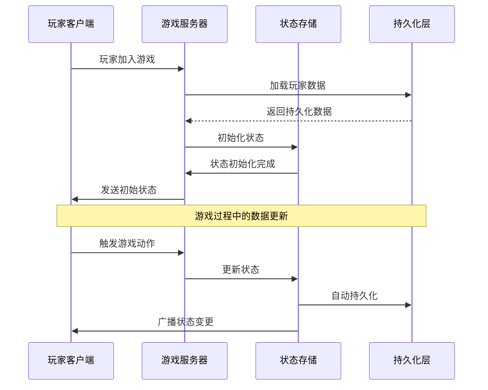

# 数据提供者架构 (Data Provider Architecture)

## 概述

数据提供者架构是现代游戏开发中处理数据持久化、状态管理和同步的核心框架。它提供了一套完整的解决方案，用于管理游戏中的所有数据流，从玩家进度到实时配置，确保数据的一致性、安全性和性能。

本架构基于以下核心原则设计：
- **统一数据访问**：所有数据访问通过统一接口进行
- **类型安全**：编译时和运行时的完整类型检查
- **自动持久化**：透明的数据保存和加载机制
- **实时同步**：客户端与服务端的状态自动同步

## 架构设计理念

### 数据分层策略

数据提供者采用分层架构，将数据按照其生命周期和用途进行分类：

#### 1. 持久化数据层 (Persistent Data Layer)
负责需要长期保存的用户数据：
- **玩家档案**：等级、经验、统计数据
- **进度数据**：成就、解锁内容、游戏进度
- **资产数据**：货币、物品、装备、材料
- **用户设置**：个性化配置、偏好设置
- **交易记录**：内购历史、交易日志

#### 2. 动态数据层 (Dynamic Data Layer)
管理运行时临时数据和配置：
- **配置数据**：游戏平衡参数、关卡设计
- **实时状态**：在线玩家、服务器状态
- **会话数据**：当前战斗、临时状态
- **缓存数据**：性能优化的临时存储

### 技术架构栈

```
┌─────────────────────────────────────────────────────────┐
│                  应用业务层 (Application Layer)           │
│                     Services & Controllers               │
├─────────────────────────────────────────────────────────┤
│                状态管理层 (State Management Layer)        │
│                      Reflex Store                        │
├─────────────────────────────────────────────────────────┤
│              数据提供者层 (Data Provider Layer)           │
│   ┌─────────────────┐    ┌─────────────────────────────┐ │
│   │   持久化引擎     │    │      动态数据管理           │ │
│   │  (Persistence)  │    │   (Dynamic Data Manager)   │ │
│   └─────────────────┘    └─────────────────────────────┘ │
├─────────────────────────────────────────────────────────┤
│                存储抽象层 (Storage Abstraction)           │
│   ┌─────────────┐  ┌─────────────┐  ┌─────────────────┐ │
│   │   Lapis     │  │   Cache     │  │   Remote API    │ │
│   │  DataStore  │  │   System    │  │    Gateway      │ │
│   └─────────────┘  └─────────────┘  └─────────────────┘ │
└─────────────────────────────────────────────────────────┘
```

## 核心组件详解

### 1. 持久化引擎 (Persistence Engine)
**职责**：管理需要长期保存的数据
- **存储后端**：基于 Lapis 的 DataStore 封装
- **生命周期管理**：文档的创建、读取、更新、关闭
- **自动保存**：状态变更时的透明持久化
- **版本控制**：数据结构迁移和兼容性处理
- **事务支持**：确保数据一致性的原子操作

### 2. 状态同步器 (State Synchronizer)
**职责**：维护客户端与服务端的状态一致性
- **实时广播**：基于 Reflex 的状态变更传播
- **增量同步**：只传输变更的数据部分
- **冲突解决**：处理并发修改的策略
- **连接管理**：处理网络中断和重连机制
- **权限控制**：确保只有授权的状态变更

### 3. 动态数据管理器 (Dynamic Data Manager)
**职责**：处理临时和配置类数据
- **配置加载**：从外部源加载游戏配置
- **热更新支持**：运行时配置的动态更新
- **缓存策略**：智能的数据缓存和失效
- **内存优化**：避免不必要的数据驻留
- **依赖注入**：为业务逻辑提供配置数据

### 4. 存储抽象层 (Storage Abstraction)
**职责**：提供统一的存储接口
- **多后端支持**：DataStore、内存、远程 API
- **性能监控**：存储操作的性能指标
- **错误处理**：存储失败的降级和重试
- **数据校验**：确保数据完整性和格式正确

## 数据流转机制

### 玩家数据生命周期



### 状态更新流水线

```
┌─────────────────┐    ┌─────────────────┐    ┌─────────────────┐
│   业务触发       │    │   状态管理       │    │   持久化层       │
│                │    │                │    │                │
│ Service Action  │───▶│ Producer Action │───▶│ Auto Persist   │
│                │    │                │    │                │
│ User Input     │    │ State Change   │    │ DataStore Save │
│                │    │                │    │                │
│ System Event   │    │ Middleware     │    │ Error Handling │
└─────────────────┘    └─────────────────┘    └─────────────────┘
                              │
                              ▼
                       ┌─────────────────┐
                       │   客户端同步     │
                       │                │
                       │ Broadcast      │
                       │                │
                       │ State Sync     │
                       └─────────────────┘
```

### 数据查询优化流程

```
查询请求
    │
    ├─ 内存缓存检查 ────────┐
    │                      │
    ├─ Store 状态查询 ──────┤
    │                      │
    └─ 持久化层回退 ────────┤
                          │
                          ▼
                    ┌─────────────┐
                    │  缓存更新    │
                    │  性能统计    │
                    │  错误处理    │
                    └─────────────┘
                          │
                          ▼
                      返回结果
```

## 架构设计原则

### 1. 单一数据源原则 (Single Source of Truth)
- **状态统一管理**：所有状态变更通过统一的 Store 进行
- **避免数据冗余**：每个数据只在一个地方定义和维护
- **一致性保证**：确保所有消费者看到的数据都是一致的

### 2. 不可变性原则 (Immutability)
- **状态不可变**：所有状态更新都创建新的状态对象
- **时间旅行调试**：支持状态的回滚和重放
- **并发安全**：避免竞态条件和数据竞争

### 3. 声明式数据流 (Declarative Data Flow)
- **函数式更新**：使用纯函数描述状态变更
- **可预测性**：相同的输入始终产生相同的输出
- **易于测试**：状态变更逻辑易于单元测试

### 4. 分层解耦原则 (Layered Decoupling)
- **依赖注入**：通过接口而非具体实现进行依赖
- **适配器模式**：存储后端可插拔替换
- **中间件架构**：功能通过中间件组合

### 5. 性能优先原则 (Performance First)
- **懒加载策略**：按需加载数据以减少内存占用
- **批量操作**：合并多个操作以减少网络和存储开销
- **智能缓存**：基于访问模式的自适应缓存策略
- **增量同步**：只传输发生变化的数据部分

### 6. 容错性原则 (Fault Tolerance)
- **优雅降级**：存储失败时的备用策略
- **自动重试**：网络和存储错误的智能重试机制
- **数据校验**：多层次的数据完整性检查
- **错误隔离**：单个组件的失败不影响整体系统

## 实现指南

### 数据模型设计

#### 1. 定义数据结构
```typescript
// shared/store/persistent/types.ts
export interface PlayerData {
    readonly player: PlayerState;      // 玩家基础信息
    readonly inventory: InventoryState; // 背包系统
    readonly achievements: AchievementsState; // 成就系统
    readonly equipment: EquipmentState; // 装备系统
    readonly settings: PlayerSettings;  // 用户设置
}

// 类型安全的默认数据
export const defaultPlayerData: PlayerData = {
    player: initialPlayerState,
    inventory: initialInventoryState,
    achievements: initialAchievementsState,
    equipment: initialEquipmentState,
    settings: initialSettings,
};
```

#### 2. 创建状态切片 (Slices)
```typescript
// shared/store/player/slice.ts
export const playerSlice = createProducer(initialPlayerState, {
    // 纯函数状态更新
    updateLevel: (state, level: number) => ({
        ...state,
        levelInfo: {
            ...state.levelInfo,
            level,
        },
    }),
    
    // 批量更新支持
    updateMultipleStats: (state, updates: Partial<PlayerStats>) => ({
        ...state,
        stats: { ...state.stats, ...updates },
    }),
});
```

### 服务层集成

#### 1. 数据服务实现
```typescript
@Service()
export class PlayerDataService {
    constructor(
        private readonly store: ServerStore,
        private readonly logger: Logger,
    ) {}
    
    // 异步数据加载
    public async loadPlayerData(player: Player): Promise<Document<PlayerData> | void> {
        try {
            const document = await this.collection.load(`${player.UserId}`);
            
            // 建立状态同步
            const unsubscribe = this.store.subscribe(
                selectPlayerData(tostring(player.UserId)),
                (data) => data && document.write(data)
            );
            
            // 初始化状态
            this.store.loadPlayerData(tostring(player.UserId), document.read());
            
            return document;
        } catch (error) {
            this.logger.Error(`Failed to load player data: ${error}`);
            throw error;
        }
    }
}
```

#### 2. 业务逻辑服务
```typescript
@Service()
export class PlayerService {
    constructor(
        private readonly store: ServerStore,
        private readonly dataService: PlayerDataService,
    ) {}
    
    // 业务逻辑方法
    public addExperience(playerId: string, amount: number): void {
        const currentState = this.store.getState();
        const playerData = selectPlayerData(playerId)(currentState);
        
        if (!playerData) return;
        
        // 调用 producer 方法更新状态
        this.store.addExperience(playerId, amount);
        
        // 检查升级条件
        this.checkLevelUp(playerId);
    }
    
    private checkLevelUp(playerId: string): void {
        // 升级逻辑...
    }
}
```

### 客户端状态管理

#### 1. 状态订阅
```typescript
// client/controllers/player-controller.ts
@Controller()
export class PlayerController implements OnStart {
    constructor(private readonly store: ClientStore) {}
    
    onStart(): void {
        // 订阅玩家等级变化
        this.store.subscribe(
            selectPlayerLevel(),
            (level, previousLevel) => {
                if (level > previousLevel) {
                    this.handleLevelUp(level);
                }
            }
        );
    }
    
    private handleLevelUp(newLevel: number): void {
        // 处理升级效果...
    }
}
```

#### 2. UI 组件集成
```typescript
// client/ui/player-info/player-info.tsx
export function PlayerInfo(): React.Element {
    const playerData = useSelector(selectPlayerData());
    const playerLevel = useSelector(selectPlayerLevel());
    
    if (!playerData) {
        return <LoadingSpinner />;
    }
    
    return (
        <Frame>
            <TextLabel Text={`Level: ${playerLevel}`} />
            <TextLabel Text={`XP: ${playerData.levelInfo.experience}`} />
        </Frame>
    );
}
```

## 最佳实践

### 1. 数据模型设计模式

#### 领域驱动设计 (Domain-Driven Design)
```typescript
// 按业务域组织数据结构
interface GameData {
    // 玩家域
    player: {
        profile: PlayerProfile;
        progression: PlayerProgression;
        statistics: PlayerStatistics;
    };
    
    // 游戏内容域
    content: {
        inventory: InventoryData;
        equipment: EquipmentData;
        achievements: AchievementData;
    };
    
    // 系统域
    system: {
        settings: UserSettings;
        preferences: UserPreferences;
    };
}
```

#### 版本化数据结构
```typescript
interface VersionedData<T> {
    version: string;
    data: T;
    migrations?: Array<DataMigration>;
}

// 支持数据迁移的结构
interface PlayerDataV2 extends VersionedData<PlayerData> {
    version: "2.0.0";
    data: PlayerData;
    migrations: [
        PlayerDataV1ToV2Migration,
        // 更多迁移...
    ];
}
```

### 2. 性能优化策略

#### 选择器模式 (Selector Pattern)
```typescript
// 使用记忆化选择器避免重复计算
const selectPlayerLevel = createSelector(
    [selectPlayerData],
    (playerData) => playerData?.levelInfo.level ?? 1
);

// 组合选择器
const selectPlayerPowerLevel = createSelector(
    [selectPlayerLevel, selectPlayerEquipment],
    (level, equipment) => calculatePowerLevel(level, equipment)
);
```

#### 批量操作优化
```typescript
// 批量状态更新
export const batchUpdatePlayerData = (updates: Partial<PlayerData>[]) => {
    return (state: PlayerData) => {
        return updates.reduce((acc, update) => ({
            ...acc,
            ...update,
        }), state);
    };
};
```

### 3. 错误处理与恢复

#### 优雅降级策略
```typescript
@Service()
export class PlayerDataServiceWithFallback {
    async loadPlayerData(player: Player): Promise<PlayerData> {
        try {
            // 尝试从主存储加载
            return await this.primaryStorage.load(player.UserId);
        } catch (primaryError) {
            this.logger.Warn("Primary storage failed, trying backup");
            
            try {
                // 回退到备份存储
                return await this.backupStorage.load(player.UserId);
            } catch (backupError) {
                this.logger.Error("All storage failed, using default data");
                
                // 最终回退到默认数据
                return this.createDefaultPlayerData(player);
            }
        }
    }
}
```

#### 自动重试机制
```typescript
class RetryableDataOperation {
    async execute<T>(
        operation: () => Promise<T>,
        maxRetries = 3,
        backoffMs = 1000
    ): Promise<T> {
        for (let attempt = 1; attempt <= maxRetries; attempt++) {
            try {
                return await operation();
            } catch (error) {
                if (attempt === maxRetries) throw error;
                
                await this.wait(backoffMs * attempt);
            }
        }
        
        throw new Error("Max retries exceeded");
    }
}
```

### 4. 安全与数据完整性

#### 数据校验管道
```typescript
interface DataValidator<T> {
    validate(data: T): ValidationResult;
}

class PlayerDataValidator implements DataValidator<PlayerData> {
    validate(data: PlayerData): ValidationResult {
        const errors: string[] = [];
        
        // 基础数据校验
        if (!data.player.playerId) {
            errors.push("Player ID is required");
        }
        
        // 业务规则校验
        if (data.player.levelInfo.level < 1 || data.player.levelInfo.level > 100) {
            errors.push("Player level must be between 1 and 100");
        }
        
        // 数据一致性校验
        if (data.player.currency.gold < 0) {
            errors.push("Currency cannot be negative");
        }
        
        return {
            isValid: errors.length === 0,
            errors,
        };
    }
}
```

#### 权限控制
```typescript
enum DataPermission {
    READ = "read",
    WRITE = "write",
    DELETE = "delete",
}

interface DataAccessControl {
    checkPermission(
        userId: string,
        dataType: string,
        permission: DataPermission
    ): boolean;
}

@Service()
export class SecurePlayerDataService {
    constructor(
        private readonly accessControl: DataAccessControl,
        private readonly dataService: PlayerDataService,
    ) {}
    
    async updatePlayerData(
        requesterId: string,
        targetPlayerId: string,
        updates: Partial<PlayerData>
    ): Promise<boolean> {
        // 权限检查
        if (!this.accessControl.checkPermission(
            requesterId,
            "playerData",
            DataPermission.WRITE
        )) {
            throw new Error("Insufficient permissions");
        }
        
        // 执行更新
        return await this.dataService.updatePlayerData(targetPlayerId, updates);
    }
}
```

### 5. 监控与可观测性

#### 性能监控
```typescript
class DataProviderMetrics {
    private readonly metrics = new Map<string, PerformanceMetric>();
    
    recordOperation(operation: string, duration: number, success: boolean): void {
        const metric = this.metrics.get(operation) ?? new PerformanceMetric();
        metric.record(duration, success);
        this.metrics.set(operation, metric);
    }
    
    getMetrics(): Map<string, PerformanceMetric> {
        return new Map(this.metrics);
    }
}
```

#### 数据健康检查
```typescript
interface HealthCheck {
    name: string;
    check(): Promise<HealthStatus>;
}

class DataStoreHealthCheck implements HealthCheck {
    name = "DataStore";
    
    async check(): Promise<HealthStatus> {
        try {
            await this.dataStore.ping();
            return { healthy: true };
        } catch (error) {
            return { 
                healthy: false, 
                message: `DataStore error: ${error}` 
            };
        }
    }
}
```

## 扩展话题

### 高级模式

- **事件溯源 (Event Sourcing)**：通过事件序列重构状态
- **CQRS 模式**：读写分离的数据访问模式
- **分布式缓存**：跨服务器的数据缓存策略
- **实时同步**：WebSocket 和 HTTP/2 的实时数据推送

### 性能调优

- **内存池管理**：减少垃圾回收压力
- **批处理优化**：合并多个操作以提高效率
- **索引策略**：优化查询性能的数据结构设计
- **压缩算法**：减少存储和传输成本

### 企业级特性

- **多租户支持**：单实例服务多个用户群体
- **审计日志**：完整的数据变更追踪
- **灾难恢复**：数据备份和恢复策略
- **合规性**：GDPR、COPPA 等法规遵循

## 相关文档

- [持久化策略](081_persistence-strategy.md) - 数据持久化的具体实现方案
- [数据迁移](082_persistence-migration.md) - 版本升级时的数据迁移机制  
- [动态数据策略](083_dynamic-strategy.md) - 动态数据的管理和优化技术
- [状态管理](../070_state/070_state.md) - Reflex 状态管理框架详解
- [网络通信](../050_network/050_network.md) - 客户端服务端通信机制