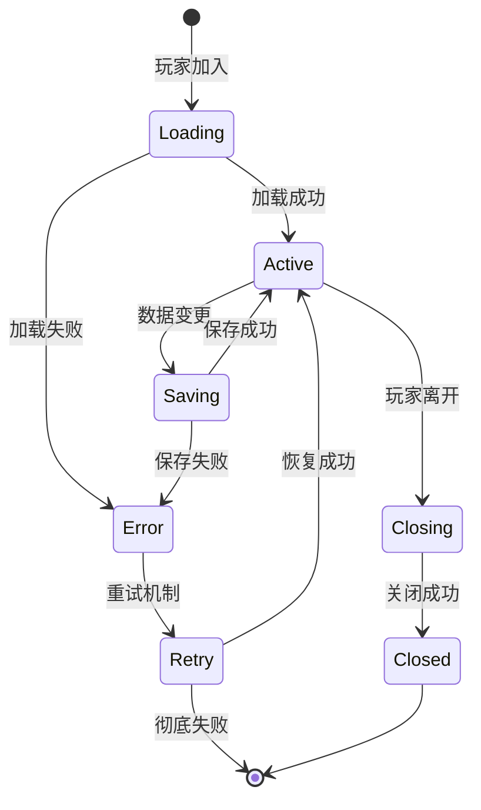

# 持久化策略 (Persistence Strategy)

## 概述

持久化策略是数据提供者架构中的核心组件，负责将游戏中的关键数据安全、高效地保存到持久化存储中。本文档详细介绍了如何设计和实现一个可靠的数据持久化系统，包括存储选择、数据结构设计、性能优化和错误处理。

## 架构设计

### 分层持久化模型

```
┌─────────────────────────────────────────────────────────┐
│                  应用数据层 (Application Data)            │
│                    业务对象和状态                         │
├─────────────────────────────────────────────────────────┤
│                 持久化抽象层 (Persistence Abstraction)    │
│                  Repository & Data Access                │
├─────────────────────────────────────────────────────────┤
│                 存储适配层 (Storage Adapter)              │
│        Lapis DataStore │ Memory Cache │ External APIs     │
├─────────────────────────────────────────────────────────┤
│                 底层存储 (Physical Storage)               │
│         Roblox DataStore │ Redis │ Database              │
└─────────────────────────────────────────────────────────┘
```

### 数据分类策略

#### 1. 关键数据 (Critical Data)
需要强一致性保证的核心玩家数据：
- **玩家进度**：等级、经验、成就进度
- **虚拟资产**：货币、物品、装备
- **内购记录**：交易历史、游戏通行证
- **统计数据**：游戏时长、关键指标

#### 2. 重要数据 (Important Data)
需要最终一致性的用户数据：
- **游戏设置**：音频、图像、控制选项
- **社交数据**：好友列表、公会信息
- **自定义内容**：个性化配置、用户创建内容

#### 3. 缓存数据 (Cache Data)
可以重新计算或获取的临时数据：
- **排行榜**：实时排名、统计信息
- **配置数据**：游戏平衡参数、活动数据
- **会话数据**：当前游戏状态、临时进度

## 存储技术选型

### Lapis DataStore 集成

#### 优势分析
- **原生集成**：与 Roblox 平台深度整合
- **自动备份**：内置数据冗余和恢复机制
- **类型安全**：TypeScript 支持和编译时检查
- **事务支持**：原子操作保证数据一致性

#### 配置示例
```typescript
import { createCollection, setConfig } from "@rbxts/lapis";
import type { PlayerData } from "shared/store/persiste
nt/types";

// 环境配置
if (IS_DEVELOPMENT) {
    setConfig({
        dataStoreService: new DataStoreServiceMock(),
        defaultOptions: {
            migration: true,
            retries: 3,
            saveInterval: 30, // 30秒自动保存
        }
    });
}

// 创建数据集合
const playerCollection = createCollection<PlayerData>("PlayerData", {
    defaultData: defaultPlayerData,
    validate: (data) => PlayerDataValidator.validate(data),
    transform: (data) => PlayerDataMigrator.migrate(data),
});
```

### 多层缓存策略

#### 1. 内存缓存层 (Memory Cache)
```typescript
class MemoryCache<T> {
    private cache = new Map<string, CacheEntry<T>>();
    private readonly ttl: number;
    
    constructor(ttlSeconds: number = 300) {
        this.ttl = ttlSeconds * 1000;
    }
    
    set(key: string, value: T): void {
        this.cache.set(key, {
            value,
            timestamp: Date.now(),
            hits: 0,
        });
    }
    
    get(key: string): T  < /dev/null |  undefined {
        const entry = this.cache.get(key);
        if (\!entry) return undefined;
        
        // TTL 检查
        if (Date.now() - entry.timestamp > this.ttl) {
            this.cache.delete(key);
            return undefined;
        }
        
        entry.hits++;
        return entry.value;
    }
}
```

#### 2. 分布式缓存层 (Distributed Cache)
```typescript
interface DistributedCache {
    get<T>(key: string): Promise<T | undefined>;
    set<T>(key: string, value: T, ttl?: number): Promise<void>;
    invalidate(pattern: string): Promise<void>;
}

class RedisCache implements DistributedCache {
    constructor(private readonly client: RedisClient) {}
    
    async get<T>(key: string): Promise<T | undefined> {
        const data = await this.client.get(key);
        return data ? JSON.parse(data) : undefined;
    }
    
    async set<T>(key: string, value: T, ttl = 3600): Promise<void> {
        await this.client.setex(key, ttl, JSON.stringify(value));
    }
    
    async invalidate(pattern: string): Promise<void> {
        const keys = await this.client.keys(pattern);
        if (keys.length > 0) {
            await this.client.del(...keys);
        }
    }
}
```

## 数据生命周期管理

### 文档生命周期



### 自动保存机制

```typescript
@Service()
export class AutoSaveService {
    private readonly saveQueue = new Map<string, NodeJS.Timeout>();
    private readonly batchSaveQueue = new Set<string>();
    
    constructor(
        private readonly dataService: PlayerDataService,
        private readonly logger: Logger,
    ) {
        // 定期批量保存
        setInterval(() => this.processBatchSave(), 30000); // 30秒
    }
    
    // 延迟保存：防止频繁写入
    scheduleDelayedSave(playerId: string, delayMs = 5000): void {
        // 清除已有的保存任务
        const existingTimer = this.saveQueue.get(playerId);
        if (existingTimer) {
            clearTimeout(existingTimer);
        }
        
        // 设置新的延迟保存
        const timer = setTimeout(() => {
            this.savePlayerData(playerId);
            this.saveQueue.delete(playerId);
        }, delayMs);
        
        this.saveQueue.set(playerId, timer);
    }
    
    // 立即保存：关键数据变更
    async saveImmediately(playerId: string): Promise<void> {
        const timer = this.saveQueue.get(playerId);
        if (timer) {
            clearTimeout(timer);
            this.saveQueue.delete(playerId);
        }
        
        await this.savePlayerData(playerId);
    }
    
    // 批量保存：优化性能
    private async processBatchSave(): Promise<void> {
        const playerIds = Array.from(this.batchSaveQueue);
        if (playerIds.length === 0) return;
        
        this.batchSaveQueue.clear();
        
        const savePromises = playerIds.map(playerId => 
            this.savePlayerData(playerId).catch(error => 
                this.logger.Error(`Batch save failed for ${playerId}: ${error}`)
            )
        );
        
        await Promise.allSettled(savePromises);
    }
}
```

## 事务管理

### ACID 特性保证

#### 原子性 (Atomicity)
```typescript
class TransactionManager {
    async executeTransaction<T>(
        operations: Array<() => Promise<T>>
    ): Promise<T[]> {
        const results: T[] = [];
        const rollbackActions: Array<() => Promise<void>> = [];
        
        try {
            for (const operation of operations) {
                const result = await operation();
                results.push(result);
                
                // 记录回滚操作
                rollbackActions.push(async () => {
                    await this.rollbackOperation(result);
                });
            }
            
            return results;
        } catch (error) {
            // 执行回滚
            await this.rollback(rollbackActions);
            throw error;
        }
    }
    
    private async rollback(actions: Array<() => Promise<void>>): Promise<void> {
        // 逆序执行回滚
        for (const action of actions.reverse()) {
            try {
                await action();
            } catch (rollbackError) {
                // 记录回滚失败，但继续执行其他回滚
                console.error("Rollback failed:", rollbackError);
            }
        }
    }
}
```

#### 一致性 (Consistency)
```typescript
interface DataConstraint<T> {
    validate(data: T): ValidationResult;
    fix?(data: T): T;
}

class PlayerDataConstraints implements DataConstraint<PlayerData> {
    validate(data: PlayerData): ValidationResult {
        const violations: string[] = [];
        
        // 货币约束
        if (data.player.currency.gold < 0) {
            violations.push("金币不能为负数");
        }
        
        // 等级约束
        if (data.player.levelInfo.level > 100) {
            violations.push("等级不能超过100");
        }
        
        // 背包约束
        if (data.inventory.items.size() > data.inventory.maxSlots) {
            violations.push("背包物品超出容量限制");
        }
        
        return {
            isValid: violations.length === 0,
            violations,
        };
    }
    
    fix(data: PlayerData): PlayerData {
        return {
            ...data,
            player: {
                ...data.player,
                currency: {
                    ...data.player.currency,
                    gold: Math.max(0, data.player.currency.gold),
                },
                levelInfo: {
                    ...data.player.levelInfo,
                    level: Math.min(100, data.player.levelInfo.level),
                },
            },
        };
    }
}
```

### 分布式事务处理

```typescript
// 两阶段提交协议实现
class TwoPhaseCommitManager {
    private readonly participants: TransactionParticipant[] = [];
    
    async commit(transactionId: string): Promise<boolean> {
        // Phase 1: Prepare
        const prepareResults = await Promise.allSettled(
            this.participants.map(p => p.prepare(transactionId))
        );
        
        const allPrepared = prepareResults.every(
            result => result.status === "fulfilled" && result.value === true
        );
        
        if (\!allPrepared) {
            // 中止事务
            await this.abort(transactionId);
            return false;
        }
        
        // Phase 2: Commit
        const commitResults = await Promise.allSettled(
            this.participants.map(p => p.commit(transactionId))
        );
        
        const allCommitted = commitResults.every(
            result => result.status === "fulfilled"
        );
        
        if (\!allCommitted) {
            // 部分提交失败，需要补偿
            await this.compensate(transactionId);
        }
        
        return allCommitted;
    }
}
```

## 性能优化

### 写入优化策略

#### 1. 写入合并 (Write Coalescing)
```typescript
class WriteCoalescer<T> {
    private pendingWrites = new Map<string, PendingWrite<T>>();
    private readonly flushInterval: number;
    
    constructor(flushIntervalMs = 1000) {
        this.flushInterval = flushIntervalMs;
        this.startFlushTimer();
    }
    
    write(key: string, data: T): void {
        const pending = this.pendingWrites.get(key);
        
        if (pending) {
            // 合并写入
            pending.data = { ...pending.data, ...data };
            pending.lastUpdate = Date.now();
        } else {
            // 新的写入
            this.pendingWrites.set(key, {
                key,
                data,
                lastUpdate: Date.now(),
            });
        }
    }
    
    private startFlushTimer(): void {
        setInterval(() => {
            this.flush();
        }, this.flushInterval);
    }
    
    private async flush(): Promise<void> {
        const writes = Array.from(this.pendingWrites.values());
        this.pendingWrites.clear();
        
        await Promise.allSettled(
            writes.map(write => this.performWrite(write))
        );
    }
}
```

#### 2. 压缩存储
```typescript
interface DataCompressor {
    compress<T>(data: T): string;
    decompress<T>(compressed: string): T;
}

class LZ4Compressor implements DataCompressor {
    compress<T>(data: T): string {
        const json = JSON.stringify(data);
        return LZ4.compress(json);
    }
    
    decompress<T>(compressed: string): T {
        const json = LZ4.decompress(compressed);
        return JSON.parse(json);
    }
}

// 在存储层使用压缩
class CompressedStorage<T> {
    constructor(
        private readonly storage: Storage<string>,
        private readonly compressor: DataCompressor,
    ) {}
    
    async save(key: string, data: T): Promise<void> {
        const compressed = this.compressor.compress(data);
        await this.storage.save(key, compressed);
    }
    
    async load(key: string): Promise<T | undefined> {
        const compressed = await this.storage.load(key);
        return compressed ? this.compressor.decompress<T>(compressed) : undefined;
    }
}
```

### 读取优化策略

#### 1. 预测性预加载
```typescript
class PredictiveLoader {
    private accessPatterns = new Map<string, AccessPattern>();
    
    recordAccess(playerId: string, dataType: string): void {
        const pattern = this.accessPatterns.get(playerId) ?? new AccessPattern();
        pattern.recordAccess(dataType);
        this.accessPatterns.set(playerId, pattern);
    }
    
    async preloadForPlayer(playerId: string): Promise<void> {
        const pattern = this.accessPatterns.get(playerId);
        if (\!pattern) return;
        
        const predictedData = pattern.getPredictedAccess();
        const preloadPromises = predictedData.map(dataType =>
            this.loadDataType(playerId, dataType)
        );
        
        await Promise.allSettled(preloadPromises);
    }
}
```

#### 2. 分页加载
```typescript
interface PaginationOptions {
    page: number;
    pageSize: number;
    sortBy?: string;
    sortOrder?: "asc" | "desc";
}

class PaginatedDataLoader<T> {
    async loadPage(
        collection: string,
        options: PaginationOptions
    ): Promise<PaginatedResult<T>> {
        const { page, pageSize, sortBy, sortOrder } = options;
        const offset = (page - 1) * pageSize;
        
        const [items, totalCount] = await Promise.all([
            this.loadItems(collection, offset, pageSize, sortBy, sortOrder),
            this.getTotalCount(collection),
        ]);
        
        return {
            items,
            pagination: {
                page,
                pageSize,
                totalPages: Math.ceil(totalCount / pageSize),
                totalItems: totalCount,
                hasNext: offset + pageSize < totalCount,
                hasPrevious: page > 1,
            },
        };
    }
}
```

## 错误处理与恢复

### 分层错误处理

```typescript
enum ErrorSeverity {
    LOW = "low",
    MEDIUM = "medium",
    HIGH = "high",
    CRITICAL = "critical"
}

interface ErrorHandler {
    canHandle(error: Error): boolean;
    handle(error: Error): Promise<ErrorHandlingResult>;
    getSeverity(): ErrorSeverity;
}

class NetworkErrorHandler implements ErrorHandler {
    canHandle(error: Error): boolean {
        return error.name === "NetworkError" || 
               error.message.includes("timeout");
    }
    
    async handle(error: Error): Promise<ErrorHandlingResult> {
        // 重试机制
        for (let attempt = 1; attempt <= 3; attempt++) {
            try {
                await this.wait(1000 * attempt); // 指数退避
                await this.retryOperation();
                return { recovered: true, attempt };
            } catch (retryError) {
                if (attempt === 3) {
                    return { recovered: false, error: retryError };
                }
            }
        }
        
        return { recovered: false, error };
    }
    
    getSeverity(): ErrorSeverity {
        return ErrorSeverity.MEDIUM;
    }
}
```

### 数据恢复策略

#### 1. 自动数据修复
```typescript
class DataRepairService {
    async repairPlayerData(playerId: string): Promise<RepairResult> {
        const data = await this.loadPlayerData(playerId);
        if (\!data) {
            return { success: false, reason: "数据不存在" };
        }
        
        const repairActions: RepairAction[] = [];
        
        // 检查并修复数据完整性
        if (this.isDataCorrupted(data)) {
            repairActions.push(await this.repairCorruption(data));
        }
        
        // 检查并修复业务逻辑违规
        if (this.hasBusinessRuleViolations(data)) {
            repairActions.push(await this.repairBusinessRules(data));
        }
        
        // 检查并修复缺失字段
        if (this.hasMissingFields(data)) {
            repairActions.push(await this.repairMissingFields(data));
        }
        
        if (repairActions.length > 0) {
            await this.saveRepairedData(playerId, data);
            await this.logRepairActions(playerId, repairActions);
        }
        
        return {
            success: true,
            repairActions,
            message: `修复了 ${repairActions.length} 个数据问题`,
        };
    }
}
```

#### 2. 备份与恢复
```typescript
class BackupService {
    async createBackup(playerId: string): Promise<BackupInfo> {
        const data = await this.loadPlayerData(playerId);
        const backupId = this.generateBackupId();
        const timestamp = Date.now();
        
        const backup: PlayerDataBackup = {
            id: backupId,
            playerId,
            data,
            timestamp,
            checksum: this.calculateChecksum(data),
        };
        
        await this.saveBackup(backup);
        
        return {
            id: backupId,
            timestamp,
            size: this.calculateSize(data),
        };
    }
    
    async restoreBackup(playerId: string, backupId: string): Promise<boolean> {
        const backup = await this.loadBackup(backupId);
        if (\!backup || backup.playerId \!== playerId) {
            return false;
        }
        
        // 验证备份完整性
        const calculatedChecksum = this.calculateChecksum(backup.data);
        if (calculatedChecksum \!== backup.checksum) {
            throw new Error("备份数据已损坏");
        }
        
        // 创建当前数据的备份
        await this.createBackup(playerId);
        
        // 恢复数据
        await this.savePlayerData(playerId, backup.data);
        
        return true;
    }
}
```

## 监控与诊断

### 性能指标监控

```typescript
class PersistenceMetrics {
    private metrics = {
        operations: new Map<string, OperationMetrics>(),
        errors: new Map<string, number>(),
        latency: new LatencyTracker(),
        throughput: new ThroughputTracker(),
    };
    
    recordOperation(
        operation: string,
        duration: number,
        success: boolean,
        dataSize?: number
    ): void {
        // 记录操作指标
        const opMetrics = this.metrics.operations.get(operation) ?? new OperationMetrics();
        opMetrics.record(duration, success, dataSize);
        this.metrics.operations.set(operation, opMetrics);
        
        // 记录错误统计
        if (\!success) {
            const errorCount = this.metrics.errors.get(operation) ?? 0;
            this.metrics.errors.set(operation, errorCount + 1);
        }
        
        // 记录延迟和吞吐量
        this.metrics.latency.record(operation, duration);
        this.metrics.throughput.record(operation, dataSize ?? 0);
    }
    
    getReport(): MetricsReport {
        return {
            operations: this.getOperationReport(),
            errors: this.getErrorReport(),
            performance: this.getPerformanceReport(),
            health: this.getHealthReport(),
        };
    }
}
```

### 数据质量监控

```typescript
class DataQualityMonitor {
    async checkDataQuality(playerId: string): Promise<QualityReport> {
        const data = await this.loadPlayerData(playerId);
        if (\!data) {
            return { score: 0, issues: ["数据不存在"] };
        }
        
        const checks = [
            this.checkCompleteness(data),
            this.checkConsistency(data),
            this.checkValidity(data),
            this.checkFreshness(data),
        ];
        
        const results = await Promise.all(checks);
        const issues = results.flatMap(result => result.issues);
        const score = this.calculateQualityScore(results);
        
        return {
            score,
            issues,
            recommendations: this.generateRecommendations(results),
        };
    }
    
    private calculateQualityScore(results: CheckResult[]): number {
        const weights = [0.3, 0.3, 0.25, 0.15]; // 完整性、一致性、有效性、新鲜度
        let totalScore = 0;
        
        for (let i = 0; i < results.length; i++) {
            totalScore += results[i].score * weights[i];
        }
        
        return Math.round(totalScore * 100);
    }
}
```

## 最佳实践

### 1. 数据设计原则

- **扁平化结构**：避免深层嵌套，提高序列化性能
- **版本兼容**：所有字段都应该是可选的，支持渐进式迁移
- **大小限制**：单个文档不超过 4MB，单个字段不超过 260KB
- **索引友好**：查询字段放在对象顶层，便于建立索引

### 2. 性能优化建议

- **批量操作**：合并多个小操作为单个大操作
- **异步处理**：使用异步 I/O 避免阻塞主线程
- **连接池**：复用数据库连接减少连接开销
- **压缩存储**：对大型数据使用压缩算法

### 3. 安全性考虑

- **数据加密**：敏感数据使用 AES 加密存储
- **访问控制**：实现基于角色的数据访问控制
- **审计日志**：记录所有数据修改操作
- **输入验证**：严格验证所有外部输入

### 4. 可维护性原则

- **接口抽象**：使用接口隔离具体实现
- **依赖注入**：通过 DI 容器管理依赖关系
- **单元测试**：为所有持久化逻辑编写测试
- **文档完整**：维护完整的 API 文档和变更日志

## 故障排查指南

### 常见问题诊断

#### 1. 数据加载失败
```typescript
class LoadFailureDiagnostic {
    async diagnose(playerId: string): Promise<DiagnosticResult> {
        const checks = [
            () => this.checkPlayerExists(playerId),
            () => this.checkDataStoreStatus(),
            () => this.checkNetworkConnectivity(),
            () => this.checkQuotaLimits(),
            () => this.checkDataIntegrity(playerId),
        ];
        
        for (const check of checks) {
            const result = await check();
            if (\!result.passed) {
                return {
                    issue: result.issue,
                    solution: result.solution,
                    severity: result.severity,
                };
            }
        }
        
        return { issue: "未知问题", severity: ErrorSeverity.HIGH };
    }
}
```

#### 2. 性能问题诊断
```typescript
class PerformanceDiagnostic {
    async analyzeSlowOperation(operationId: string): Promise<AnalysisResult> {
        const trace = await this.getOperationTrace(operationId);
        const bottlenecks = this.identifyBottlenecks(trace);
        
        return {
            totalDuration: trace.totalDuration,
            bottlenecks,
            recommendations: this.generateOptimizations(bottlenecks),
            metrics: this.extractMetrics(trace),
        };
    }
    
    private identifyBottlenecks(trace: OperationTrace): Bottleneck[] {
        return trace.spans
            .filter(span => span.duration > trace.totalDuration * 0.1)
            .map(span => ({
                operation: span.operation,
                duration: span.duration,
                percentage: (span.duration / trace.totalDuration) * 100,
            }));
    }
}
```

## 相关文档

- [数据迁移策略](082_persistence-migration.md) - 版本升级时的数据迁移处理
- [动态数据管理](083_dynamic-strategy.md) - 配置和缓存数据的管理策略
- [状态管理架构](../070_state/070_state.md) - Reflex 状态管理系统详解
- [错误处理框架](../090_error/090_error.md) - 统一的错误处理和恢复机制
