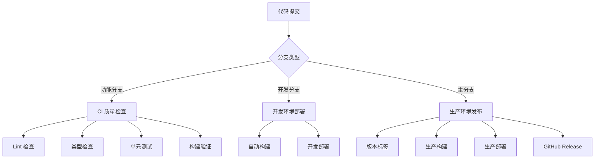

# CI/CD 持续集成与部署框架

本框架为 Roblox TypeScript 项目提供企业级 CI/CD 解决方案，通过 GitHub Actions 实现全流程自动化，支持多环境部署、质量管控和性能监控。

## 架构设计

框架采用分层工作流架构，确保代码质量与部署效率：



## 工作流配置

### 1. 持续集成工作流 (ci.yaml)

负责代码质量控制和构建验证，确保每次代码变更都符合标准：

```yaml
name: CI Pipeline

on:
  pull_request:
    branches: [main, develop, staging]
  push:
    branches: [develop]
  workflow_dispatch:

jobs:
  quality-gate:
    name: 代码质量检查
    runs-on: ubuntu-latest
    timeout-minutes: 15
    
    steps:
      - name: 检出代码
        uses: actions/checkout@v4
        with:
          fetch-depth: 0
      
      - name: 设置 PNPM 环境
        uses: pnpm/action-setup@v4
        with:
          version: latest
      
      - name: 设置 Node.js 环境
        uses: actions/setup-node@v4
        with:
          node-version: '20'
          cache: 'pnpm'
      
      - name: 设置 Rokit 工具链
        uses: CompeyDev/setup-rokit@v0.1.2
        with:
          token: ${{ secrets.GITHUB_TOKEN }}
      
      - name: 安装依赖
        run: pnpm install --frozen-lockfile
      
      - name: 生成配置类型定义
        run: pnpm run config:codegen
        continue-on-error: false
      
      - name: TypeScript 类型检查
        run: pnpm run typecheck
      
      - name: 代码规范检查
        run: pnpm run lint
      
      - name: 单元测试
        run: pnpm run test --coverage
      
      - name: 构建验证
        run: pnpm run prod:build
      
      - name: 生成地图文件
        run: rokit run rojo build build.project.json --output game.rbxlx
      
      - name: 上传构建产物
        uses: actions/upload-artifact@v4
        with:
          name: build-artifacts
          path: |
            game.rbxlx
            dist/
          retention-days: 7
```

**质量门禁特性**：
- 多分支触发策略
- 超时保护机制
- 工具链版本锁定
- 构建产物存储
- 失败快速反馈

### 2. Pull Request 质量检查工作流

专为 PR 设计的增强质量检查，提供智能反馈机制：

```yaml
name: PR Quality Gate

on:
  pull_request:
    types: [opened, synchronize, reopened]
    branches: [main, develop, staging]
  pull_request_review:
    types: [submitted]

jobs:
  pr-quality-check:
    name: PR 质量验证
    runs-on: ubuntu-latest
    permissions:
      contents: read
      pull-requests: write
      checks: write
    
    steps:
      - name: 检出代码
        uses: actions/checkout@v4
        with:
          ref: ${{ github.event.pull_request.head.sha }}
          fetch-depth: 0
      
      - name: 智能缓存
        uses: actions/cache@v4
        with:
          path: |
            ~/.pnpm-store
            node_modules
            .tsbuildinfo
          key: ${{ runner.os }}-pnpm-${{ hashFiles('**/pnpm-lock.yaml') }}-${{ hashFiles('**/tsconfig.json') }}
          restore-keys: |
            ${{ runner.os }}-pnpm-${{ hashFiles('**/pnpm-lock.yaml') }}-
            ${{ runner.os }}-pnpm-
      
      - name: 设置环境
        uses: ./.github/actions/setup-environment
      
      - name: 变更文件分析
        id: changes
        uses: dorny/paths-filter@v2
        with:
          filters: |
            typescript:
              - 'src/**/*.ts'
              - 'src/**/*.tsx'
            configs:
              - 'configs/**/*'
            tests:
              - 'src/**/*.test.ts'
              - 'src/**/*.jack.ts'
      
      - name: 代码规范检查
        id: lint
        run: |
          if [[ "${{ steps.changes.outputs.typescript }}" == "true" ]]; then
            pnpm run lint --format=json --output-file=lint-results.json
          else
            echo "跳过 Lint 检查 - 无 TypeScript 文件变更"
          fi
        continue-on-error: true
      
      - name: 类型检查
        id: typecheck
        run: |
          if [[ "${{ steps.changes.outputs.typescript }}" == "true" ]]; then
            pnpm run typecheck 2>&1 | tee typecheck-results.txt
          else
            echo "跳过类型检查 - 无 TypeScript 文件变更"
          fi
        continue-on-error: true
      
      - name: 单元测试 (变更相关)
        id: test
        run: |
          if [[ "${{ steps.changes.outputs.tests }}" == "true" ]]; then
            pnpm run test --changedSince=origin/${{ github.base_ref }} --coverage
          else
            echo "跳过测试 - 无测试文件变更"
          fi
        continue-on-error: true
      
      - name: 构建检查
        id: build
        run: pnpm run prod:build
        continue-on-error: true
      
      - name: 生成质量报告
        id: quality-report
        if: always()
        run: |
          echo "## 🔍 代码质量检查报告" > pr-comment.md
          echo "" >> pr-comment.md
          
          # Lint 结果
          if [[ -f lint-results.json ]]; then
            LINT_ERRORS=$(cat lint-results.json | jq '.[] | length' | awk '{sum+=$1} END {print sum}')
            if [[ $LINT_ERRORS -gt 0 ]]; then
              echo "❌ **代码规范**: 发现 $LINT_ERRORS 个问题" >> pr-comment.md
            else
              echo "✅ **代码规范**: 通过" >> pr-comment.md
            fi
          fi
          
          # 类型检查
          if [[ "${{ steps.typecheck.outcome }}" == "success" ]]; then
            echo "✅ **类型检查**: 通过" >> pr-comment.md
          else
            echo "❌ **类型检查**: 失败" >> pr-comment.md
          fi
          
          # 构建检查
          if [[ "${{ steps.build.outcome }}" == "success" ]]; then
            echo "✅ **构建验证**: 通过" >> pr-comment.md
          else
            echo "❌ **构建验证**: 失败" >> pr-comment.md
          fi
          
          echo "" >> pr-comment.md
          echo "### 修复建议" >> pr-comment.md
          echo "运行以下命令修复常见问题：" >> pr-comment.md
          echo '```bash' >> pr-comment.md
          echo 'pnpm run lint --fix  # 自动修复代码规范问题' >> pr-comment.md
          echo 'pnpm run typecheck   # 检查类型错误' >> pr-comment.md
          echo 'pnpm run test        # 运行单元测试' >> pr-comment.md
          echo '```' >> pr-comment.md
      
      - name: 更新 PR 评论
        if: always()
        uses: actions/github-script@v7
        with:
          script: |
            const fs = require('fs');
            const comment = fs.readFileSync('pr-comment.md', 'utf8');
            
            // 查找现有评论
            const { data: comments } = await github.rest.issues.listComments({
              owner: context.repo.owner,
              repo: context.repo.repo,
              issue_number: context.issue.number,
            });
            
            const botComment = comments.find(comment => 
              comment.user.type === 'Bot' && 
              comment.body.includes('🔍 代码质量检查报告')
            );
            
            if (botComment) {
              // 更新现有评论
              await github.rest.issues.updateComment({
                owner: context.repo.owner,
                repo: context.repo.repo,
                comment_id: botComment.id,
                body: comment
              });
            } else {
              // 创建新评论
              await github.rest.issues.createComment({
                owner: context.repo.owner,
                repo: context.repo.repo,
                issue_number: context.issue.number,
                body: comment
              });
            }
      
      - name: 设置检查状态
        if: always()
        uses: actions/github-script@v7
        with:
          script: |
            const checkPassed = 
              '${{ steps.lint.outcome }}' === 'success' &&
              '${{ steps.typecheck.outcome }}' === 'success' &&
              '${{ steps.build.outcome }}' === 'success';
            
            await github.rest.checks.create({
              owner: context.repo.owner,
              repo: context.repo.repo,
              name: 'PR Quality Gate',
              head_sha: context.payload.pull_request.head.sha,
              status: 'completed',
              conclusion: checkPassed ? 'success' : 'failure',
              output: {
                title: checkPassed ? '✅ 质量检查通过' : '❌ 质量检查失败',
                summary: '详细信息请查看 PR 评论'
              }
            });
```

**智能化特性**：
- 变更文件检测，仅检查相关代码
- 智能缓存策略，加速构建
- 自动生成质量报告
- PR 评论实时更新
- 检查状态可视化

#### 3. 开发环境部署 (release-development.yaml)

开发环境自动部署工作流：

```yaml
name: Release Development

on:
  push:
    branches: [develop]
    paths:
      - 'src/**/*'
      - 'configs/**/*'
      - '*.project.json'
  workflow_dispatch:

concurrency:
  group: development-deployment
  cancel-in-progress: true

jobs:
  deploy:
    runs-on: ubuntu-latest
    steps:
      # VPN 连接（确保 IP 匹配）
      - name: Connect VPN
        uses: kota65535/github-openvpn-connect-action@v3
        with:
          config_file: ${{ secrets.VPN_CONFIG }}
      
      # 编译和构建
      - run: npx rbxtsc --verbose
      - run: rojo build ./default.project.json --output place.rbxlx
      
      # 部署到开发环境
      - name: Deploy to Development
        run: pnpm exec mantle publish
        env:
          ROBLOSECURITY: ${{ secrets.ROBLOSECURITY }}
```

**关键特性**：
- 文件变更自动触发
- 并发控制避免冲突
- VPN 安全连接
- 详细日志输出

#### 4. 生产环境发布 (release.yaml)

生产环境发布工作流，包含完整的版本管理：

```yaml
name: Release Production

on:
  pull_request:
    types: [closed]
    branches: [main]
  workflow_dispatch:

jobs:
  release:
    if: github.event.pull_request.merged == true
    runs-on: ubuntu-latest
    steps:
      # 生产构建
      - run: pnpm prod:build --verbose
      - run: rojo build ./build.project.json --output place.rbxlx
      
      # 创建版本标签
      - name: Create Release Tag
        run: |
          VERSION=$(node -p "require('./package.json').version")
          git tag -a "v$VERSION" -m "Release v$VERSION"
          git push origin "v$VERSION"
      
      # 部署生产环境
      - name: Deploy to Production
        run: pnpm exec mantle publish --buy-enabled
        env:
          ROBLOSECURITY: ${{ secrets.ROBLOSECURITY }}
      
      # 创建 GitHub Release
      - name: Create GitHub Release
        uses: softprops/action-gh-release@v2
        with:
          tag_name: v${{ env.VERSION }}
          files: place.rbxlx
          generate_release_notes: true
```

**高级功能**：
- 自动版本标签
- GitHub Release 创建
- 生产优化构建
- 购买功能启用

## 自动化最佳实践

### 1. 分支策略

框架推荐使用 GitFlow 分支模型：

```
main (生产分支)
  ├── develop (开发分支)
  │   ├── feature/xxx (功能分支)
  │   └── fix/xxx (修复分支)
  └── hotfix/xxx (热修复分支)
```

### 2. 提交规范

使用 Conventional Commits 规范：

```bash
# 功能开发
feat: 添加新的状态管理模块

# 问题修复
fix: 修复玩家数据同步问题

# 文档更新
docs: 更新 API 文档

# 性能优化
perf: 优化渲染性能

# 重构代码
refactor: 重构网络通信模块
```

### 3. 质量门禁

框架内置多层质量保障：

1. **Pre-commit Hooks**（Husky）
   - 代码格式化（Prettier）
   - 代码规范检查（ESLint）
   - 提交信息验证（Commitlint）

2. **PR Checks**
   - 自动化测试
   - 代码覆盖率
   - 类型检查

3. **部署前验证**
   - 生产构建测试
   - 依赖安全扫描
   - 性能基准测试

### 4. 环境管理

框架支持多环境配置：

```typescript
// 环境配置示例
interface EnvironmentConfig {
  name: string;
  apiUrl: string;
  features: {
    analytics: boolean;
    purchases: boolean;
    debugging: boolean;
  };
}

const environments = {
  development: {
    name: "开发环境",
    apiUrl: "https://dev-api.example.com",
    features: {
      analytics: false,
      purchases: false,
      debugging: true,
    },
  },
  production: {
    name: "生产环境",
    apiUrl: "https://api.example.com",
    features: {
      analytics: true,
      purchases: true,
      debugging: false,
    },
  },
};
```

## 工具集成

### Rokit 工具链

框架使用 Rokit 管理开发工具：

```toml
# rokit.toml
[tools]
rojo = "rojo-rbx/rojo@7.4.4"
darklua = "seaofvoices/darklua@0.14.0"
mantle = "blake-mealey/mantle@0.11.17-prerelease"
asphalt = "jacktabscode/asphalt@0.9.1"
lune = "lune-org/lune@0.8.9"
```

### 构建脚本

框架提供了丰富的 npm 脚本：

```json
{
  "scripts": {
    // 开发相关
    "dev:compile": "rbxtsc --watch",
    "dev:sync": "rojo serve",
    "dev:start": "run-p dev:*",
    
    // 配置管理
    "config:build": "luban build",
    "config:codebuild": "luban codegen",
    "config:watch": "luban watch",
    
    // 质量检查
    "lint": "eslint src --ext .ts,.tsx",
    "lint:fix": "eslint src --ext .ts,.tsx --fix",
    "typecheck": "tsc --noEmit",
    
    // 测试相关
    "test": "jest",
    "test:watch": "jest --watch",
    "test:coverage": "jest --coverage",
    
    // 生产构建
    "prod:build": "run-s prod:*",
    "prod:compile": "rbxtsc",
    "prod:optimize": "darklua process",
    "prod:bundle": "rojo build build.project.json"
  }
}
```

## 部署配置

### Mantle 部署管理

框架集成 Mantle 进行 Roblox 部署：

```yaml
# mantle.yaml
owner: personal

state:
  remote:
    region: us-east-1
    bucket: my-game-states
    key: game-state

environments:
  - label: development
    branches: [develop]
    targetNamePrefix: "[DEV]"
    targetAccess: friends
    
  - label: production
    branches: [main]
    targetAccess: public
    configuration:
      playableDevices: [computer, phone, tablet, console]

target:
  experience:
    configuration:
      name: "My Roblox Game"
      description: "Built with roblox-ts framework"
      maxPlayerCount: 50
      avatarType: playerChoice
```

## 监控与反馈

### 1. 构建通知

集成构建状态通知：

```yaml
# 工作流通知示例
- name: Notify Build Status
  if: always()
  uses: 8398a7/action-slack@v3
  with:
    status: ${{ job.status }}
    text: |
      构建状态: ${{ job.status }}
      分支: ${{ github.ref }}
      提交: ${{ github.sha }}
```

### 2. 性能监控

框架支持集成性能监控：

```typescript
// 性能监控集成示例
import { PerformanceMonitor } from "@framework/monitoring";

const monitor = new PerformanceMonitor({
  endpoint: "https://monitoring.example.com",
  apiKey: process.env.MONITORING_API_KEY,
  environment: process.env.NODE_ENV,
});

// 自动上报构建性能
monitor.trackBuildTime();
monitor.trackBundleSize();
monitor.trackTestCoverage();
```

## 故障排除

### 常见问题

1. **构建失败**
   ```bash
   # 清理缓存重试
   pnpm store prune
   rm -rf node_modules
   pnpm install
   ```

2. **部署权限**
   ```bash
   # 验证 Roblox 凭证
   echo $ROBLOSECURITY | mantle auth verify
   ```

3. **VPN 连接**
   ```bash
   # 测试 VPN 配置
   openvpn --config vpn.conf --auth-nocache
   ```

## 扩展指南

框架的 CI/CD 系统可以轻松扩展：

1. **添加新的工作流**
   - 复制现有模板
   - 修改触发条件
   - 自定义步骤

2. **集成第三方服务**
   - 代码质量平台（SonarQube）
   - 错误追踪（Sentry）
   - 分析服务（Google Analytics）

3. **自定义部署目标**
   - 测试服务器
   - 预览环境
   - A/B 测试环境 