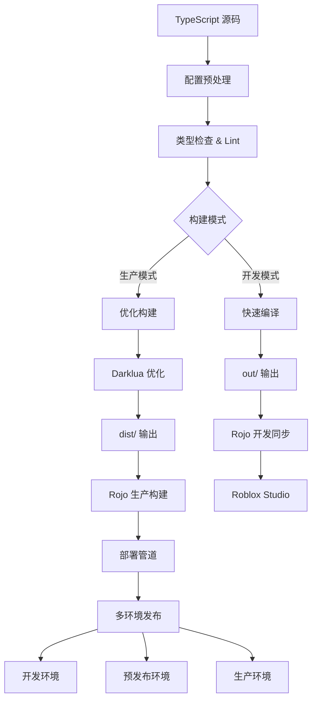

# Roblox 构建与部署系统

本框架为 Roblox TypeScript 项目提供企业级构建部署解决方案，支持多环境、多阶段构建优化，实现从源码到生产环境的全自动化流程。

## 构建架构设计

框架采用渐进式构建架构，根据目标环境和性能需求进行差异化优化：



## 项目配置管理

### 多环境配置策略

框架采用分离式配置管理，确保开发和生产环境的最佳性能：

#### 开发环境配置 (default.project.json)

专为开发体验优化，支持热重载和实时调试：

```json
{
  "name": "roblox-ts-framework-dev",
  "servePlaceIds": [YOUR_DEV_PLACE_ID],
  
  "globIgnorePaths": [
    "**/package.json",
    "**/tsconfig*.json",
    "**/*.test.ts",
    "**/*.jack.ts",
    "**/*.spec.ts",
    "**/node_modules/**",
    "**/.git/**",
    "**/dist/**"
  ],
  
  "tree": {
    "$className": "DataModel",
    
    "ServerScriptService": {
      "$className": "ServerScriptService",
      "$ignoreUnknownInstances": true,
      
      "TS": {
        "$className": "Folder",
        "$path": "out/server"
      },
      
      "BattleSession": {
        "$className": "Folder", 
        "$path": "out/battle-session/server"
      }
    },
    
    "ReplicatedStorage": {
      "$className": "ReplicatedStorage",
      "$ignoreUnknownInstances": true,
      
      "rbxts_include": {
        "$className": "Folder",
        "$path": "include",
        "node_modules": {
          "$className": "Folder",
          "@rbxts": {
            "$className": "Folder",
            "$path": "node_modules/@rbxts"
          },
          "@flamework": {
            "$className": "Folder", 
            "$path": "node_modules/@flamework"
          }
        }
      },
      
      "TS": {
        "$className": "Folder",
        "$path": "out/shared"
      },
      
      "BattleSession": {
        "$className": "Folder",
        "$path": "out/battle-session/shared"
      },
      
      "Configs": {
        "$className": "Folder",
        "$path": "assets/configs"
      }
    },
    
    "StarterPlayer": {
      "$className": "StarterPlayer",
      "StarterPlayerScripts": {
        "$className": "StarterPlayerScripts",
        "$ignoreUnknownInstances": true,
        
        "TS": {
          "$className": "Folder",
          "$path": "out/client"
        },
        
        "BattleSession": {
          "$className": "Folder",
          "$path": "out/battle-session/client"
        }
      }
    },
    
    "StarterGui": {
      "$className": "StarterGui",
      "$ignoreUnknownInstances": true,
      
      "ScreenGui": {
        "$className": "ScreenGui",
        "$path": "assets/ui"
      }
    },
    
    "Workspace": {
      "$className": "Workspace",
      "$ignoreUnknownInstances": true,
      
      "GameAssets": {
        "$className": "Folder",
        "$path": "assets/models"
      }
    }
  }
}
```

#### 生产环境配置 (build.project.json)

专为生产环境优化，注重性能和体积控制：

```json
{
  "name": "roblox-ts-framework-prod",
  "servePlaceIds": [YOUR_PROD_PLACE_ID],
  
  "globIgnorePaths": [
    "**/package.json",
    "**/tsconfig*.json", 
    "**/*.d.ts",
    "**/*.test.*",
    "**/*.jack.*",
    "**/*.spec.*",
    "**/jest.config.*",
    "**/__tests__/**",
    "**/__mocks__/**",
    "**/node_modules/**",
    "**/.git/**",
    "**/out/**",
    "**/docs/**",
    "**/*.md"
  ],
  
  "tree": {
    "$className": "DataModel",
    
    "ServerScriptService": {
      "$className": "ServerScriptService",
      
      "TS": {
        "$className": "Folder",
        "$path": "dist/server"
      },
      
      "BattleSession": {
        "$className": "Folder",
        "$path": "dist/battle-session/server"
      }
    },
    
    "ReplicatedStorage": {
      "$className": "ReplicatedStorage",
      
      "rbxts_include": {
        "$className": "Folder",
        "$path": "include",
        "node_modules": {
          "$className": "Folder",
          "@rbxts": {
            "$className": "Folder",
            "$path": "node_modules/@rbxts"
          }
        }
      },
      
      "TS": {
        "$className": "Folder", 
        "$path": "dist/shared"
      },
      
      "BattleSession": {
        "$className": "Folder",
        "$path": "dist/battle-session/shared"
      },
      
      "Configs": {
        "$className": "Folder",
        "$path": "assets/configs"
      }
    },
    
    "StarterPlayer": {
      "$className": "StarterPlayer",
      "StarterPlayerScripts": {
        "$className": "StarterPlayerScripts",
        
        "TS": {
          "$className": "Folder",
          "$path": "dist/client"
        },
        
        "BattleSession": {
          "$className": "Folder",
          "$path": "dist/battle-session/client"
        }
      }
    },
    
    "StarterGui": {
      "$className": "StarterGui",
      "ScreenGui": {
        "$className": "ScreenGui",
        "$path": "assets/ui"
      }
    },
    
    "Workspace": {
      "$className": "Workspace",
      "GameAssets": {
        "$className": "Folder",
        "$path": "assets/models"
      }
    }
  }
}
```

#### 预发布环境配置 (staging.project.json)

用于生产前最后验证的预发布环境：

```json
{
  "name": "roblox-ts-framework-staging",
  "servePlaceIds": [YOUR_STAGING_PLACE_ID],
  
  "globIgnorePaths": [
    "**/package.json",
    "**/tsconfig*.json",
    "**/*.d.ts",
    "**/*.test.*",
    "**/*.jack.*",
    "**/node_modules/**",
    "**/.git/**"
  ],
  
  "tree": {
    "$className": "DataModel",
    "$ignoreUnknownInstances": true,
    
    "ServerScriptService": {
      "$className": "ServerScriptService",
      "TS": {
        "$className": "Folder",
        "$path": "dist/server"
      }
    },
    
    "ReplicatedStorage": {
      "$className": "ReplicatedStorage", 
      "TS": {
        "$className": "Folder",
        "$path": "dist/shared"
      },
      "Configs": {
        "$className": "Folder",
        "$path": "assets/configs"
      }
    },
    
    "StarterPlayer": {
      "$className": "StarterPlayer",
      "StarterPlayerScripts": {
        "$className": "StarterPlayerScripts",
        "TS": {
          "$className": "Folder",
          "$path": "dist/client"
        }
      }
    }
  }
}
```

### 配置最佳实践

1. **环境隔离**：不同环境使用独立的 Place ID
2. **文件过滤**：生产环境排除测试和开发文件
3. **路径优化**：生产环境使用优化后的 `dist/` 目录
4. **资源管理**：统一的资源路径管理

## 构建工具链

### TypeScript 编译器 (rbxts)

框架使用 roblox-ts 编译器，支持完整的 TypeScript 特性：

```typescript
// tsconfig.json 配置示例
{
  "compilerOptions": {
    "allowSyntheticDefaultImports": true,
    "downlevelIteration": true,
    "jsx": "react",
    "jsxFactory": "React.createElement",
    "module": "commonjs",
    "moduleResolution": "Node",
    "resolveJsonModule": true,
    "strict": true,
    "target": "ESNext",
    "typeRoots": ["node_modules/@rbxts"],
    "experimentalDecorators": true
  }
}
```

### Rojo 同步工具

[Rojo](https://rojo.space/) 负责文件系统与 Roblox 的双向同步：

**核心功能**：
- 实时文件监控
- 增量同步优化
- 支持多种文件格式
- 自动类型映射

**使用示例**：
```bash
# 开发服务器
rojo serve default.project.json

# 构建地图文件
rojo build build.project.json --output game.rbxlx

# 上传到 Roblox
rojo upload build.project.json --place_id 1234567890
```

### Darklua 优化器

[Darklua](https://darklua.com/) 专门优化 Lua 代码，提升游戏性能：

```json
// .darklua.json 配置
{
  "generator": "readable",
  "rules": [
    // 移除空白和注释
    "remove_spaces",
    {
      "rule": "remove_comments",
      "except": ["^--!native", "^--!strict"]
    },
    
    // 代码优化
    "remove_assertions",
    "compute_expression",
    "remove_unused_if_branch",
    "remove_unused_while",
    "filter_after_early_return",
    "remove_empty_do",
    
    // 高级优化
    "remove_unused_variable",
    "remove_debug_profiling",
    "rename_variables",
    {
      "rule": "inject_global_value",
      "globals": {
        "__DEV__": false,
        "__PROD__": true
      }
    }
  ]
}
```

**优化效果**：
- 代码体积减少 30-50%
- 运行性能提升 10-20%
- 内存占用降低

### Rokit 工具管理

[Rokit](https://github.com/rojo-rbx/rokit) 统一管理所有构建工具：

```toml
# rokit.toml
[tools]
# 核心工具
rojo = "rojo-rbx/rojo@7.4.4"
darklua = "seaofvoices/darklua@0.14.0"

# 部署工具
mantle = "blake-mealey/mantle@0.11.17"
asphalt = "jacktabscode/asphalt@0.9.1"

# 辅助工具
lune = "lune-org/lune@0.8.9"
selene = "Kampfkarren/selene@0.27.1"
stylua = "JohnnyMorganz/StyLua@0.20.0"
```

## 部署管理

### Mantle 配置

[Mantle](https://mantledeploy.vercel.app/) 提供了完整的 Roblox 游戏部署解决方案：

```yaml
# mantle.yaml
owner: personal  # 或 group: 12345678

# 状态管理
state:
  remote:
    provider: aws  # 支持 aws, gcp, azure
    region: us-east-1
    bucket: my-game-states
    key: game/state

# 环境配置
environments:
  - label: development
    branches: [develop, feature/*]
    targetNamePrefix: "[DEV]"
    targetAccess: friends
    targetOverrides:
      configuration:
        maxPlayerCount: 10
        
  - label: staging
    branches: [staging]
    targetNamePrefix: "[STAGING]"
    targetAccess: group
    
  - label: production
    branches: [main]
    targetAccess: public
    configuration:
      playableDevices: [computer, phone, tablet, console]

# 游戏配置
target:
  experience:
    configuration:
      name: "My Awesome Game"
      description: |
        Built with roblox-ts framework
        
        Features:
        - Amazing gameplay
        - Stunning graphics
        - Cross-platform support
      genre: Adventure
      playableDevices: [computer, phone, tablet]
      privateServerPrice: 100
      enableStudioAccessToApis: true
      
    # 空间语音
    spatialVoice:
      enabled: true
      
    # 场地配置
    places:
      start:
        file: place.rbxlx
        configuration:
          name: "Main World"
          maxPlayerCount: 50
          
      lobby:
        file: lobby.rbxlx
        configuration:
          name: "Game Lobby"
          maxPlayerCount: 100
          
    # 资产配置
    assets:
      badges:
        welcome:
          name: "Welcome Badge"
          description: "Thanks for playing!"
          icon: assets/badges/welcome.png
          
      gamePasses:
        vip:
          name: "VIP Pass"
          description: "Exclusive VIP features"
          icon: assets/passes/vip.png
          price:
            base: 499
            
      products:
        coins-100:
          name: "100 Coins"
          description: "Get 100 coins"
          icon: assets/products/coins.png
          price:
            base: 99
```

### 资产管理

框架集成 Asphalt 进行资产上传和管理：

```lua
-- asphalt.config.lua
return {
  -- 资产同步配置
  assets = {
    {
      name = "GameAssets",
      directory = "assets",
      include = {"**/*.png", "**/*.jpg", "**/*.mp3"},
      exclude = {"**/temp/**", "**/backup/**"}
    }
  },
  
  -- CDN 配置
  cdn = {
    provider = "cloudflare",
    domain = "assets.mygame.com"
  },
  
  -- 优化选项
  optimization = {
    images = {
      format = "webp",
      quality = 85,
      maxSize = 2048
    },
    audio = {
      format = "ogg",
      bitrate = 128
    }
  }
}
```

## 构建流程

### 开发构建

开发构建优化了迭代速度：

```bash
# 启动开发环境
pnpm run dev:start

# 分步骤执行
pnpm run dev:compile    # TypeScript 编译
pnpm run dev:sync       # Rojo 同步
pnpm run dev:watch      # 文件监控
```

**开发特性**：
- 增量编译
- 热重载
- 源码映射
- 调试符号

### 生产构建

生产构建进行全面优化：

```bash
# 完整生产构建
pnpm run prod:build

# 构建步骤
1. clean         # 清理目录
2. compile       # TypeScript 编译
3. optimize      # Darklua 优化
4. bundle        # Rojo 打包
5. validate      # 构建验证
```

**优化内容**：
- 代码压缩
- 死代码消除
- 常量折叠
- 变量重命名

### 配置构建

框架支持 Luban 配置管理：

```bash
# 构建配置
pnpm run config:build

# 生成类型
pnpm run config:codegen

# 监听变化
pnpm run config:watch
```

## 环境管理

### 环境变量

框架支持多种环境变量配置：

```typescript
// src/shared/config/environment.ts
export interface Environment {
  readonly NODE_ENV: "development" | "production" | "test";
  readonly BUILD_VERSION: string;
  readonly BUILD_TIMESTAMP: number;
  readonly FEATURES: {
    readonly ANALYTICS: boolean;
    readonly PURCHASES: boolean;
    readonly VOICE_CHAT: boolean;
  };
}

// 编译时注入
declare const __ENVIRONMENT__: Environment;

// 使用示例
if (__ENVIRONMENT__.NODE_ENV === "development") {
  print("Debug mode enabled");
}
```

### 功能开关

通过功能开关控制特性：

```typescript
// src/shared/config/features.ts
export const FeatureFlags = {
  // 游戏特性
  NEW_COMBAT_SYSTEM: false,
  SEASONAL_EVENTS: true,
  
  // 技术特性
  USE_PARALLEL_LUA: true,
  ENABLE_STREAMING: true,
  
  // 实验特性
  BETA_UI: false,
  AI_NPCS: false,
} as const;

// 使用示例
if (FeatureFlags.NEW_COMBAT_SYSTEM) {
  // 新战斗系统逻辑
}
```

## 部署流程

### 自动部署

通过 GitHub Actions 实现自动部署：

1. **代码提交** → 触发工作流
2. **质量检查** → Lint、测试、类型检查
3. **构建打包** → 编译、优化、打包
4. **部署发布** → Mantle 部署到对应环境
5. **验证通知** → 部署状态反馈

### 手动部署

支持本地手动部署：

```bash
# 部署到开发环境
pnpm run deploy:dev

# 部署到生产环境
pnpm run deploy:prod

# 带参数部署
mantle publish --environment production --buy-enabled
```

## 性能优化

### 构建性能

1. **并行编译**
   ```json
   {
     "compilerOptions": {
       "incremental": true,
       "tsBuildInfoFile": ".tsbuildinfo"
     }
   }
   ```

2. **缓存优化**
   - TypeScript 增量编译缓存
   - Darklua 转换缓存
   - npm 包缓存

3. **按需构建**
   - 模块化构建配置
   - 条件编译支持

### 运行时性能

1. **代码分割**
   - 延迟加载模块
   - 按需导入资源

2. **资源优化**
   - 纹理压缩
   - 音频优化
   - 模型简化

## 故障排除

### 常见问题

1. **编译错误**
   ```bash
   # 清理并重新编译
   pnpm run clean
   pnpm install
   pnpm run dev:compile
   ```

2. **同步问题**
   ```bash
   # 重启 Rojo 服务
   pkill rojo
   rojo serve default.project.json
   ```

3. **部署失败**
   ```bash
   # 验证凭证
   mantle auth verify
   
   # 检查配置
   mantle validate
   ```

### 调试技巧

1. **启用详细日志**
   ```bash
   VERBOSE=true pnpm run build
   ```

2. **分步调试**
   ```bash
   # 单独运行每个步骤
   npx rbxtsc --verbose
   darklua process --verbose
   rojo build --verbose
   ```

3. **构建分析**
   ```bash
   # 生成构建报告
   pnpm run build:analyze
   ``` 