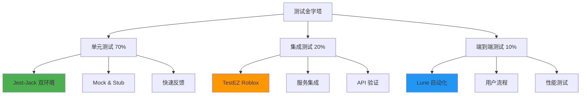

# Roblox TypeScript 测试框架

本框架为 Roblox 项目提供全方位测试解决方案，支持本地快速开发和 Roblox 环境验证的双环境测试策略，确保代码质量与系统稳定性。

## 测试架构设计

框架基于测试金字塔原理，构建分层测试体系：



## 双环境测试策略

### 1. 本地环境 (Node.js + Jest)
- **优势**：快速执行、断点调试、CI/CD 集成
- **用途**：单元测试、逻辑验证、开发阶段测试
- **工具**：Jest + Jest-Jack 框架

### 2. Roblox 环境 (Lua + TestEZ)  
- **优势**：真实环境、API 完整性、运行时验证
- **用途**：集成测试、环境兼容性、最终验证
- **工具**：TestEZ + Jest-Lua

## 测试框架配置

### Jest-Jack 双环境测试系统

采用 [roblox-ts-jest-jack](https://www.npmjs.com/package/roblox-ts-jest-jack) 实现双环境无缝测试：

#### 文件命名约定
```
src/
├── shared/utils/
│   ├── math.ts                 # 源代码
│   └── __tests__/
│       ├── math.jack.ts        # 双环境测试
│       ├── math.test.ts        # 本地专用测试
│       └── math.spec.ts        # Roblox 专用测试
```


## 编写测试

### 单元测试

单元测试针对最小可测试单元：

```typescript
// src/shared/utils/__tests__/math.jack.ts
import { describe, expect, it } from "@rbxts/jest-globals";
import { MathUtils } from "../math";

describe("MathUtils", () => {
  describe("clamp", () => {
    it("应该限制值在范围内", () => {
      expect(MathUtils.clamp(5, 0, 10)).toBe(5);
      expect(MathUtils.clamp(-5, 0, 10)).toBe(0);
      expect(MathUtils.clamp(15, 0, 10)).toBe(10);
    });
    
    it("应该处理边界情况", () => {
      expect(MathUtils.clamp(0, 0, 10)).toBe(0);
      expect(MathUtils.clamp(10, 0, 10)).toBe(10);
      expect(MathUtils.clamp(NaN, 0, 10)).toBe(0);
    });
  });
  
  describe("lerp", () => {
    it("应该正确插值", () => {
      expect(MathUtils.lerp(0, 10, 0)).toBe(0);
      expect(MathUtils.lerp(0, 10, 0.5)).toBe(5);
      expect(MathUtils.lerp(0, 10, 1)).toBe(10);
    });
    
    it("LOCAL_SKIP 应该处理极限值", () => {
      // 仅在 Roblox 环境运行
      expect(MathUtils.lerp(0, math.huge, 0.5)).toBe(math.huge);
    });
  });
});
```

### 服务测试

测试服务层业务逻辑：

```typescript
// src/server/services/__tests__/player-service.jack.ts
import { describe, expect, it, beforeEach } from "@rbxts/jest-globals";
import { PlayerService } from "../player-service";
import { createMockPlayer, createMockDataStore } from "@test-utils/mocks";

describe("PlayerService", () => {
  let playerService: PlayerService;
  let mockDataStore: ReturnType<typeof createMockDataStore>;
  
  beforeEach(() => {
    mockDataStore = createMockDataStore();
    playerService = new PlayerService(mockDataStore);
  });
  
  describe("onPlayerAdded", () => {
    it("应该初始化玩家数据", async () => {
      const mockPlayer = createMockPlayer({ UserId: 12345 });
      
      await playerService.onPlayerAdded(mockPlayer);
      
      expect(mockDataStore.get).toHaveBeenCalledWith("player_12345");
      expect(playerService.getPlayerData(mockPlayer)).toBeDefined();
    });
    
    it("应该处理新玩家", async () => {
      const mockPlayer = createMockPlayer({ UserId: 12345 });
      mockDataStore.get.mockResolvedValue(undefined);
      
      await playerService.onPlayerAdded(mockPlayer);
      
      const data = playerService.getPlayerData(mockPlayer);
      expect(data?.isNewPlayer).toBe(true);
      expect(data?.level).toBe(1);
    });
  });
});
```

### Store 测试

测试状态管理逻辑：

```typescript
// src/shared/store/__tests__/inventory-store.jack.ts
import { describe, expect, it, beforeEach } from "@rbxts/jest-globals";
import { inventorySlice } from "../slices/inventory";
import { createTestStore } from "@test-utils/store";

describe("InventoryStore", () => {
  let store: ReturnType<typeof createTestStore>;
  
  beforeEach(() => {
    store = createTestStore({
      inventory: inventorySlice
    });
  });
  
  describe("addItem", () => {
    it("应该添加物品到背包", () => {
      store.dispatch("inventory.addItem", {
        id: "sword_001",
        quantity: 1
      });
      
      const state = store.getState();
      expect(state.inventory.items["sword_001"]).toBe(1);
    });
    
    it("应该叠加相同物品", () => {
      store.dispatch("inventory.addItem", { id: "potion_001", quantity: 5 });
      store.dispatch("inventory.addItem", { id: "potion_001", quantity: 3 });
      
      const state = store.getState();
      expect(state.inventory.items["potion_001"]).toBe(8);
    });
  });
  
  describe("removeItem", () => {
    it("应该移除指定数量的物品", () => {
      store.setState({
        inventory: { items: { "arrow_001": 50 } }
      });
      
      store.dispatch("inventory.removeItem", {
        id: "arrow_001",
        quantity: 20
      });
      
      const state = store.getState();
      expect(state.inventory.items["arrow_001"]).toBe(30);
    });
  });
});
```

### UI 组件测试

测试 React 组件：

```typescript
// src/client/ui/components/__tests__/button.jack.ts
import { describe, expect, it } from "@rbxts/jest-globals";
import { render, fireEvent } from "@test-utils/react";
import { Button } from "../button";

describe("Button Component", () => {
  it("应该渲染按钮文本", () => {
    const { getByText } = render(
      <Button text="Click Me" onClick={() => {}} />
    );
    
    expect(getByText("Click Me")).toBeDefined();
  });
  
  it("应该处理点击事件", () => {
    const handleClick = jest.fn();
    const { getByText } = render(
      <Button text="Click Me" onClick={handleClick} />
    );
    
    fireEvent.click(getByText("Click Me"));
    expect(handleClick).toHaveBeenCalledTimes(1);
  });
  
  it("应该在禁用时不触发点击", () => {
    const handleClick = jest.fn();
    const { getByText } = render(
      <Button text="Click Me" onClick={handleClick} disabled />
    );
    
    fireEvent.click(getByText("Click Me"));
    expect(handleClick).never.toHaveBeenCalled();
  });
});
```

## 测试工具

### Mock 工具

框架提供了丰富的 Mock 工具：

```typescript
// test-utils/mocks/player.ts
export function createMockPlayer(overrides: Partial<Player> = {}): Player {
  return {
    UserId: 1,
    Name: "TestPlayer",
    DisplayName: "Test Player",
    AccountAge: 100,
    Character: undefined,
    Team: undefined,
    ...overrides
  } as Player;
}

// test-utils/mocks/services.ts
export function createMockDataStore() {
  return {
    get: jest.fn(),
    set: jest.fn(),
    update: jest.fn(),
    remove: jest.fn()
  };
}
```

### 测试辅助函数

```typescript
// test-utils/helpers.ts
export async function waitForCondition(
  condition: () => boolean,
  timeout = 5000
): Promise<void> {
  const start = Date.now();
  while (!condition() && Date.now() - start < timeout) {
    await wait(0.1);
  }
  if (!condition()) {
    throw new Error("Condition not met within timeout");
  }
}

export function mockTime() {
  let currentTime = 0;
  return {
    advance: (seconds: number) => {
      currentTime += seconds;
    },
    reset: () => {
      currentTime = 0;
    },
    now: () => currentTime
  };
}

## 测试最佳实践

### 测试组织

```
src/
└── shared/
    └── utils/
        ├── math.ts
        └── math.spec.ts     # roblox测试
        └── math.jack.ts     # 本地测试
```

### **设置忽略标记**

使用 `LOCAL_SKIP` 标记可以在本地环境中跳过特定测试：

```typescript
it("LOCAL_SKIP 这个测试在本地环境中会被跳过", () => {
	// 测试内容
});
```

# 与 标准jest 的偏差


The Jest Lua alignment effort aims to map as closely to Jest's API as possible, but there are a few places where language deviations require us to omit functionality or deviate our approach. Deviations are also sometimes made to maintain Lua-nativity. Any user-facing deviations are documented here.

## Globals

### `.each`
Tagged templates are not available in Lua. As an alternative, a list of tables can be passed into `each`. First argument is a string with headings separated by |, or a table with a single element containing that.

```lua
test.each('a | b | expected',
	{1, 1, 2},
	{1, 2, 3},
	{2, 1, 3}
)('returns $expected when $a is added $b', function(ref)
	local a, b, expected = ref.a, ref.b, ref.expected
	expect(a + b).toBe(expected)
end)
```

An array of arrays can still be passed, see [`.each`](api#describeeachtablename-fn-timeout).

## Expect

### `.never`
Since `not` is a reserved keyword in Lua, Jest Lua uses `never` to test the opposite of a matcher.

Some aliases are provided:
* `.arrayNotContaining`
* `.objectNotContaining`
* `.stringNotContaining`
* `.stringNotMatching`

### `expect.extend(matchers)`
The first argument that a custom matcher takes in `expect.extend(matchers)` always needs to be a `self`, which is assigned the `matcherContext`. It can be left empty with a `_` if the `matcherContext` is not needed. See the [Custom Matchers API doc](expect#custom-matchers-api) for more information.

```lua
expect.extend({
	yourMatcher = function(self, y, z)
		return {
			pass = true,
			message = function() return '' end
		}
	end
})
```

### `expect.any(typename | prototype)`
Lua doesn't have constructors for primitive types, so `expect.any` accepts either a typename string (e.g. `"number"`, `"boolean"`) or a table representing a prototype class.
- If a typename string is passed in, it checks that the received value has the `typeof()` value as the expected string
- If a table is passed in, it checks that the received value in is an instance (or a derived instance) of the expected table, using the [`instanceof` method in LuauPolyfill](https://github.com/Roblox/luau-polyfill/blob/main/src/instanceof.lua)

### `expect.nothing()`
`expect.nothing` allows for matching against nil and undefined values. You can use it inside `toMatchObject` and other similar matchers to ensure something is undefined or `nil`.

### `expect.stringMatching(string | regexp)`
`expect.stringMatching(string | regexp)` can either accept a [Lua string pattern](https://developer.roblox.com/en-us/articles/string-patterns-reference) or a [RegExp](expect#regexp).

### `.toHaveLength(number)`
`.toHaveLength(number)` uses the Lua `#` operator to check the length of the received value. Since `#` is only well defined for non-sparse array-like tables and strings it will return 0 for tables with key-value pairs. It also checks the `.length` property of the table instead if it has one.

`.toHaveLength` **cannot** be used to check the argument count of a function.

### `.toBeFalsy()`
`.toBeFalsy()` checks for Lua falsy values, which are only `false` and `nil`. That means that unlike in Javscript, `expect(0).toBeFalsy()` **does not** pass. Consequently, `.toBeTruthy()` matches anything that isn't `false` or `nil`.

### `.toBeNil()`
When doing `nil` checking, use of `.toBeNil()` and `.never.toBeNil()` is encouraged to maintain Lua syntax. The following methods are identical but provided for the sake of completeness:
- `.toBeUndefined()` is identical to `.toBeNil()`
- `.toBeDefined()` is identical to `.never.toBeNil()`
- `.toBeNull()` is an alias of `.toBeNil()`

### `.toBeInstanceOf(prototype)`
`.toBeInstanceOf(prototype)` uses the [`instanceof` method in LuauPolyfill](https://github.com/Roblox/luau-polyfill/blob/main/src/instanceof.lua) to check that a value is an instance (or a derived instance) of a prototype class.

### `.toMatch(string | regexp)`
`.toMatch` matches a [Lua string pattern](https://developer.roblox.com/en-us/articles/string-patterns-reference) or a [Regexp](expect#regexp).

### `.toMatchInstance(table)`
`.toMatchInstance` is custom matcher unique to Jest Lua that allows for matching a Roblox Instance against a table of properties.

### `.toStrictEqual()`
`toStrictEqual()` performs a `toEqual` comparison with an additional type/class check based on metatable inheritance. Our `toStrictEqual` does not check for array sparseness or for `undefined` values like the matcher does in Javascript's Jest.

### `.toThrow(error?)`
`.toThrow(error?)` can also accept custom Error objects provided by LuauPolyfill.

## Mock Functions

### `jest.fn()`
`jest.fn()` returns two values. The first return value is the mock object, which is a callable table and _can_ be treated as a mock function if the tested code accepts a callable table as being interchangeable with a function.

For cases where the tested code requires a function, pass in the second return value of `jest.fn()`, which is a forwarding function that calls the mock.
```lua
local mock, mockFn = jest.fn()
mockFn()
expect(mock).toHaveBeenCalled()
```

Note that this remains backward compatible with Jest tests translated from JavaScript, since the second argument will be dropped if not explicitly assigned.

### `mockFn.new`
Our translation of `new mockFn()` in Javascript is `mockFn.new()`

So for the following code pattern in Javascript:
```javascript
const mockFn = jest.fn()
const instance1 = new mockFn()
```
We would write it in Lua as:
```lua
local mockFn = jest.fn()
local instance1 = mockFn.new()
```

## Fake Timers

### `jest.useFakeTimers()`
`jest.useFakeTimers()` injects fake versions of Lua and Roblox timers.

The supported timers are `delay`, `tick`, `time`, `DateTime`, `task.delay`, `os.time`, and `os.clock`.

## Configuration

### `projects`
The `projects` configuration takes an array of Instances. Each entry should be a path to a datamodel Instance with a configuration file.

### Filters
Test filtering configuration options like `testMatch` or `testPathIgnorePatterns` match against the path of the test in the datamodel, not the filesystem path.