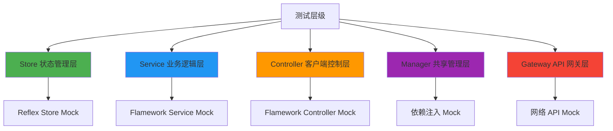
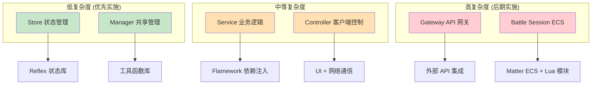

# Roblox TypeScript Mock 测试实施方案

## 概述

本方案为 Roblox TypeScript 项目提供系统性的 Mock 测试解决方案，专注解决 Flamework、Reflex 等核心框架在本地测试环境中的兼容性问题，实现高效的本地单元测试开发流程。

## 实施目标

### 核心测试层级
通过 Mock 策略实现以下架构层的本地测试：



### 预期收益
- **开发效率提升 70%**：本地测试运行速度快 10-100 倍
- **调试体验优化**：支持断点调试和实时代码覆盖率
- **CI/CD 集成**：无需 Roblox Studio 的自动化测试
- **代码质量保障**：早期发现逻辑错误和类型问题

## 技术现状分析

### 依赖复杂度评估

框架基于多层架构设计，各层级具有不同的测试复杂度：



### 核心依赖识别

#### 1. Flamework 框架
- **功能**：依赖注入、装饰器支持、生命周期管理
- **挑战**：编译时代码生成、运行时依赖解析
- **Mock 策略**：装饰器空实现 + 手动依赖注入

#### 2. Reflex 状态管理
- **功能**：Redux 模式状态管理、中间件支持
- **挑战**：仅提供类型定义，无 TypeScript 实现
- **Mock 策略**：轻量级 TypeScript 实现

#### 3. Roblox API 依赖
- **核心服务**：Players、Workspace、RunService、TweenService
- **数据服务**：DataStoreService、ReplicatedStorage
- **Mock 策略**：按需 Mock + 依赖注入

### 模块分布分析

```typescript
// 依赖复杂度矩阵
interface DependencyMatrix {
  module: string;
  flameworkUsage: "heavy" | "medium" | "light" | "none";
  reflexUsage: "heavy" | "medium" | "light" | "none"; 
  robloxApiUsage: "heavy" | "medium" | "light" | "none";
  testPriority: "high" | "medium" | "low";
}

const analysisResult: DependencyMatrix[] = [
  {
    module: "Store (状态管理)",
    flameworkUsage: "none",
    reflexUsage: "heavy", 
    robloxApiUsage: "none",
    testPriority: "high"
  },
  {
    module: "Manager (共享管理)",
    flameworkUsage: "light",
    reflexUsage: "light",
    robloxApiUsage: "light", 
    testPriority: "high"
  },
  {
    module: "Service (业务逻辑)",
    flameworkUsage: "heavy",
    reflexUsage: "medium",
    robloxApiUsage: "medium",
    testPriority: "medium"
  },
  {
    module: "Controller (客户端控制)",
    flameworkUsage: "heavy", 
    reflexUsage: "medium",
    robloxApiUsage: "heavy",
    testPriority: "medium"
  },
  {
    module: "Gateway (API 网关)",
    flameworkUsage: "medium",
    reflexUsage: "light",
    robloxApiUsage: "heavy",
    testPriority: "low"
  }
];
```

## Mock 策略

### 1. 核心依赖处理

本方案专注于解决 Flamework 和 Reflex 的本地测试问题。其他依赖（如 Lua 模块、Roblox API）可通过依赖注入在测试时提供 mock 实现。

### 2. Flamework 处理策略

Flamework 主要提供装饰器和依赖注入功能，在测试中我们需要：

#### 简单 Mock 实现

```typescript
// test-utils/flamework-mocks.ts
// 装饰器实现 - 返回原类
export const Service = () => (target: any) => target;
export const Controller = () => (target: any) => target;
export const Gateway = () => (target: any) => target;
export const OnInit = () => (target: any, key: string) => {};
export const OnStart = () => (target: any, key: string) => {};

// 依赖注入 - 测试时手动注入
export const Dependency = <T>() => undefined as unknown as T;
```

#### 测试中的依赖注入处理

```typescript
// 测试示例：手动注入依赖
describe("ShopService", () => {
    let shopService: ShopService;
    
    beforeEach(() => {
        // 手动创建依赖
        const mockItemManager = createMockItemManager();
        const mockCurrencyManager = createMockCurrencyManager();
        
        // 手动注入依赖
        shopService = new ShopService(mockItemManager, mockCurrencyManager);
    });
    
    it("should process purchase", async () => {
        const result = await shopService.purchaseItem(mockPlayer, "item_001");
        expect(result.success).toBe(true);
    });
});
```

### 3. Reflex TypeScript 实现策略

由于 Reflex 只提供了接口定义而没有 TypeScript 实现，我们需要提供一个轻量级的 TypeScript 版本：

1. **核心实现**
```typescript
// test-utils/reflex-implementation.ts
type ProducerActions<State> = {
    [key: string]: (state: State, ...args: any[]) => State;
};

class ProducerImpl<State, Actions extends ProducerActions<State>> {
    private state: State;
    private listeners: Set<(state: State) => void> = new Set();
    private middlewares: Array<any> = [];

    constructor(initialState: State, private actions: Actions) {
        this.state = initialState;
    }

    getState(): State {
        return this.state;
    }

    setState(newState: State): void {
        this.state = newState;
        this.listeners.forEach(listener => listener(newState));
    }

    subscribe(listener: (state: State) => void): () => void {
        this.listeners.add(listener);
        return () => this.listeners.delete(listener);
    }

    dispatch<K extends keyof Actions>(
        action: K,
        ...args: Parameters<Actions[K]> extends [State, ...infer P] ? P : never
    ): void {
        const handler = this.actions[action];
        const newState = handler(this.state, ...args);
        this.setState(newState);
    }
}

export function createProducer<State, Actions extends ProducerActions<State>>(
    initialState: State,
    actions: Actions
) {
    const producer = new ProducerImpl(initialState, actions);
    
    // 创建 dispatch 代理
    const dispatchers = {} as any;
    for (const [name, action] of Object.entries(actions)) {
        dispatchers[name] = (...args: any[]) => producer.dispatch(name as any, ...args);
    }
    
    return Object.assign(producer, dispatchers);
}

export function combineProducers<T extends Record<string, any>>(producers: T) {
    const combinedState = {} as any;
    const combinedActions = {} as any;
    
    for (const [key, producer] of Object.entries(producers)) {
        combinedState[key] = producer.getState();
        // 合并 actions
        for (const actionName in producer) {
            if (typeof producer[actionName] === 'function' && actionName !== 'getState') {
                combinedActions[`${key}.${actionName}`] = producer[actionName];
            }
        }
    }
    
    return createProducer(combinedState, combinedActions);
}

export function createSelector<State, Result, Params extends any[] = []>(
    selector: (state: State) => any,
    combiner: (...args: any[]) => Result
): (state: State, ...params: Params) => Result {
    let lastState: State;
    let lastResult: Result;
    
    return (state: State, ...params: Params) => {
        if (state === lastState) {
            return lastResult;
        }
        lastState = state;
        lastResult = combiner(selector(state), ...params);
        return lastResult;
    };
}
```

2. **中间件支持**
```typescript
// test-utils/reflex-middleware.ts
export function applyMiddleware(...middlewares: any[]) {
    return (producer: any) => {
        // 简化的中间件实现
        const originalDispatch = producer.dispatch;
        let dispatch = originalDispatch;
        
        const chain = middlewares.map(middleware => 
            middleware(producer)(dispatch)
        );
        
        dispatch = chain.reduceRight((next, middleware) => 
            middleware(next), originalDispatch
        );
        
        producer.dispatch = dispatch;
        return producer;
    };
}
```

3. **测试专用简化版**
```typescript
// test-utils/reflex-test-helpers.ts
export function createTestProducer<State>(initialState: State) {
    return createProducer(initialState, {
        setState: (_, newState: State) => newState,
        updateState: (state, updates: Partial<State>) => ({ ...state, ...updates })
    });
}

// 模拟网络同步（跳过实际网络通信）
export function createBroadcaster() {
    return { 
        start: jest.fn(), 
        dispatch: jest.fn(),
        middleware: jest.fn()
    };
}

export function createBroadcastReceiver() {
    return { 
        start: jest.fn(), 
        dispatch: jest.fn(),
        middleware: jest.fn()
    };
}

// 确保导出与 @rbxts/reflex 兼容的完整接口
export { createProducer, combineProducers, createSelector, applyMiddleware };
```

## 实施计划

### 第一阶段：基础设施搭建（1-2周）

1. **创建核心测试工具**
   ```
   test-utils/
   ├── flamework-mocks.ts       # Flamework 简单 mock
   ├── reflex-implementation.ts # Reflex TypeScript 实现
   ├── test-helpers.ts          # 测试辅助函数
   └── jest-setup.ts            # Jest 配置
   ```

2. **配置 TypeScript 路径别名**
   ```json
   // tsconfig.test.json - 添加测试用的路径映射
   {
       "extends": "./tsconfig.json",
       "compilerOptions": {
           "lib": ["ESNext", "DOM"],
           "noLib": false,
           "baseUrl": "jest-jack/polyfill",
           "rootDir": "jest-jack/polyfill",
           "paths": {
               // 保留 jest-jack 的配置
               "@rbxts/jest-globals": ["./node_modules/@jest/globals"],
               "@polyfill": ["./jest-jack/polyfill"],
               "@testable/*": ["./src/server/testable/*"],
               
               // 核心依赖映射
               "@rbxts/reflex": ["../../test-utils/reflex-implementation"],
               "@flamework/core": ["../../test-utils/flamework-mocks"]
           },
           "types": ["jest", "node"]
       },
       "include": [
           "jest-jack/polyfill/**/*", 
           "./src/**/__tests__/**/*.jack.ts",
           "./test-utils/**/*"
       ]
   }
   ```

3. **关键原则**
   - **被测试代码零修改**：所有源代码保持原样，通过 TypeScript 路径别名替换依赖
   - **利用 jest-jack**：jest-jack 已经处理好了 TypeScript 编译和模块解析，只需配置路径别名
   - **接口兼容**：所有 mock/实现必须与原始库接口完全兼容
   - **按需实现**：只实现项目实际使用的 API，避免过度工程

### 第二阶段：Store 层测试（1周）

1. **为每个 store slice 编写测试**
   - producer actions 测试
   - state 更新测试
   - selectors 测试
   - 组合 producers 测试

示例：
```typescript
// src/shared/store/player/__tests__/player.jack.ts
// 注意：被测试的代码保持不变，仍然从 @rbxts/reflex 导入
// Jest 会自动将其映射到我们的实现
import { playerSlice } from "../slice";
import { selectPlayerData } from "../selectors";

describe("Player Store", () => {
    beforeEach(() => {
        // 重置 store 状态
        // playerSlice 已经通过 Jest 的模块映射使用我们的实现
        playerSlice.resetState();
    });
    
    it("should update player data", () => {
        // 使用原始的 action 调用方式
        playerSlice.updateData({ level: 10 });
        const state = playerSlice.getState();
        expect(state.data.level).toBe(10);
    });
    
    it("should handle selectors", () => {
        playerSlice.updateData({ level: 5, experience: 100 });
        // selectPlayerData 内部使用 @rbxts/reflex 的 createSelector
        // 但实际运行的是我们的实现
        const data = selectPlayerData(playerSlice.getState());
        expect(data).toEqual({ level: 5, experience: 100 });
    });
    
    it("should support combined producers", () => {
        // 测试 combineProducers 功能
        const store = combineProducers({
            player: playerSlice,
            // 其他 slices...
        });
        
        expect(store.getState().player).toBeDefined();
    });
});
```

### 第三阶段：Manager 层测试（1周）

1. **通过依赖注入处理共享模块**
2. **测试管理器核心功能**

示例：
```typescript
// src/shared/managers/__tests__/item-manager.jack.ts
import { ItemManager } from "../item-manager";

describe("ItemManager", () => {
    let itemManager: ItemManager;
    
    beforeEach(() => {
        // 创建 mock 依赖
        const mockAssets = {
            getAsset: jest.fn().mockReturnValue({ id: "test", name: "Test Item" })
        };
        
        // 手动注入依赖
        itemManager = new ItemManager(mockAssets as any);
    });
    
    it("should validate item requirements", () => {
        const mockPlayer = { level: 10 };
        const mockItem = { requiredLevel: 5 };
        
        const result = itemManager.canUseItem(mockPlayer, mockItem);
        expect(result).toBe(true);
    });
    
    it("should load item definitions", () => {
        const definitions = [
            { id: "item1", name: "Item 1" },
            { id: "item2", name: "Item 2" }
        ];
        
        itemManager.loadDefinitions(definitions);
        expect(itemManager.getDefinition("item1")).toBeDefined();
    });
});
```

### 第四阶段：Service 层测试（2周）

1. **Mock Manager 依赖**
2. **Mock Store 依赖**
3. **测试业务逻辑**

示例：
```typescript
// src/server/services/__tests__/shop-service.jack.ts
describe("ShopService", () => {
    let shopService: ShopService;
    
    beforeEach(() => {
        const mockItemManager = createMockItemManager();
        const mockCurrencyManager = createMockCurrencyManager();
        shopService = new ShopService(mockItemManager, mockCurrencyManager);
    });
    
    it("should process purchase", async () => {
        const result = await shopService.purchaseItem(mockPlayer, "item_001");
        expect(result.success).toBe(true);
    });
});
```

### 第五阶段：Controller 和 Gateway 测试（1周）

1. **Mock Service 层**
2. **测试控制流程**
3. **测试 API 端点**

## 关键挑战与解决方案

### 1. 战斗系统集成
- **挑战**：大量 Lua 代码，复杂的 ECS 架构
- **解决**：将战斗系统作为黑盒测试，仅 mock 入口和出口

### 2. 异步操作处理
- **挑战**：Roblox 的 Promise 实现与标准不同
- **解决**：使用 jest-jack 提供的 Promise polyfill

### 3. 类型安全
- **挑战**：Mock 对象的类型匹配
- **解决**：使用 TypeScript 的 Partial 和工具类型

### 4. 依赖注入处理
- **挑战**：Flamework 的依赖注入在测试环境中的处理
- **解决**：手动创建实例并注入 mock 依赖

## 预期收益

1. **快速反馈**：本地测试运行速度快 10-100 倍
2. **调试便利**：支持断点调试和代码覆盖率
3. **CI/CD 集成**：可在 GitHub Actions 中运行
4. **降低测试成本**：减少对 Roblox Studio 的依赖

## 风险评估

1. **Mock 准确性**：Mock 可能与实际行为有差异
   - 缓解：定期运行 Roblox 环境测试验证
   
2. **维护成本**：需要维护 Mock 代码
   - 缓解：只 Mock 稳定的接口，使用自动化工具

3. **团队适应**：需要团队学习新的测试方式
   - 缓解：提供培训和文档，逐步推广

## 推荐实施步骤

1. **先导试点**：选择 1-2 个简单的 Manager 作为试点
2. **建立规范**：制定测试编写规范和 Mock 指南
3. **工具支持**：开发 Mock 生成工具，降低编写成本
4. **逐步推广**：从底层（Manager/Store）向上层推广
5. **持续优化**：根据实践反馈优化 Mock 策略

## 成功标准

- 本地测试覆盖率达到 80% 以上
- 单元测试运行时间 < 30 秒
- Mock 维护时间 < 总开发时间的 10%
- 团队接受度 > 80%

## 结论

在 store、service、controller、manager、gateway 层推行本地测试是**可行的**，关键在于解决 Flamework 和 Reflex 这两个核心依赖：

### 核心要点

1. **依赖处理方案**：
   - **Reflex**：提供轻量级 TypeScript 实现，确保状态管理可测试
   - **Flamework**：简单 mock 装饰器，测试时手动注入依赖
   - **其他依赖**：通过依赖注入在测试时提供 mock

2. **技术实现**：
   - 使用 TypeScript 路径别名替换包引用
   - 利用 jest-jack 已有的测试基础设施
   - 被测试代码保持零修改

3. **推进策略**：
   - 从 Store 层开始（状态管理是核心）
   - Manager 层次之（业务逻辑基础）
   - Service/Controller/Gateway 逐步推进

4. **预期收益**：
   - 本地测试运行速度快 10-100 倍
   - 支持断点调试和代码覆盖率
   - 可集成到 CI/CD 流程
   - 降低对 Roblox Studio 的依赖

通过专注于 Flamework 和 Reflex 的处理，其他依赖都可以通过标准的测试模式（依赖注入、mock）来解决，大大简化了实施复杂度，提高了方案的可行性。