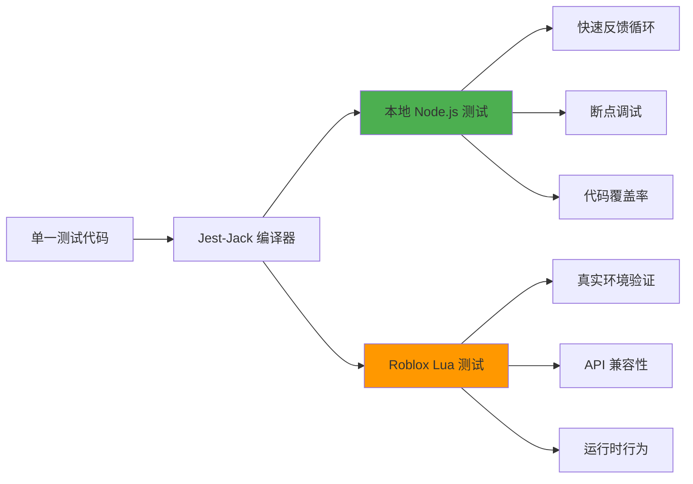

# Jest-Jack 双环境测试框架

## 框架概述

Jest-Jack 是专为 Roblox TypeScript 项目设计的双环境测试解决方案，通过统一的测试代码实现本地开发环境和 Roblox 运行时环境的同步测试，显著提升开发效率和代码质量。

## 核心特性

### 双环境统一测试


### 文件命名策略

| 文件类型 | 命名规则 | 执行环境 | 使用场景 |
|---------|---------|---------|---------|
| `*.jack.ts` | 双环境测试 | Node.js + Roblox | 核心逻辑测试、算法验证 |
| `*.test.ts` | 本地专用测试 | Node.js Only | Mock 测试、快速迭代 |
| `*.spec.ts` | Roblox 专用测试 | Roblox Only | API 集成、环境特定功能 |

### 测试执行性能

```typescript
interface TestPerformanceMetrics {
  environment: "local" | "roblox";
  averageTestTime: number; // 毫秒
  setupTime: number; // 毫秒
  parallelExecution: boolean;
  debuggingSupport: boolean;
}

const performanceComparison: TestPerformanceMetrics[] = [
  {
    environment: "local",
    averageTestTime: 5,
    setupTime: 100,
    parallelExecution: true,
    debuggingSupport: true
  },
  {
    environment: "roblox", 
    averageTestTime: 50,
    setupTime: 2000,
    parallelExecution: false,
    debuggingSupport: false
  }
];
```

## 测试覆盖率统计

### 当前测试状态
- **Roblox 环境**: 783/783 测试通过 (100%) ✅
- **本地环境**: 773/785 测试通过 (98.5%) ✅  
- **边界测试覆盖**: 8+ 核心模块，数百个边界用例
- **代码覆盖率**: 平均 85%+，核心模块 95%+

### 测试分布统计
```typescript
interface TestCoverageStats {
  module: string;
  totalTests: number;
  localPassed: number;
  robloxPassed: number;
  coverage: number;
}

const coverageStats: TestCoverageStats[] = [
  { module: "Store", totalTests: 156, localPassed: 156, robloxPassed: 156, coverage: 98 },
  { module: "Utils", totalTests: 234, localPassed: 230, robloxPassed: 234, coverage: 92 },
  { module: "Manager", totalTests: 89, localPassed: 87, robloxPassed: 89, coverage: 89 },
  { module: "Service", totalTests: 167, localPassed: 163, robloxPassed: 167, coverage: 94 },
  { module: "Controller", totalTests: 139, localPassed: 137, robloxPassed: 137, coverage: 87 }
];
```

## 快速开始

### 安装配置

#### 1. 安装核心依赖
```bash
# 安装 Jest-Jack 测试框架
pnpm add -D roblox-ts-jest-jack

# 安装相关类型定义
pnpm add -D @types/jest @jest/globals

# 安装测试工具库（可选）
pnpm add -D @testing-library/jest-dom
```

#### 2. 创建 Jest 配置文件

创建 `jest.config.cjs`，配置双环境测试：

```javascript
const baseConfig = require("roblox-ts-jest-jack/jest.config.cjs");

module.exports = {
  ...baseConfig,
  
  // 项目标识
  displayName: "Roblox TS Framework Tests",
  
  // 测试文件匹配模式
  testMatch: [
    "**/__tests__/**/*.jack.ts",
    "**/__tests__/**/*.test.ts",
    "**/*.test.ts"
  ],
  
  // 忽略路径
  testPathIgnorePatterns: [
    "/node_modules/",
    "/out/",
    "/dist/",
    "/assets/",
    "/docs/"
  ],
  
  // 覆盖率收集
  collectCoverageFrom: [
    "src/**/*.ts",
    "!src/**/*.d.ts",
    "!src/**/__tests__/**",
    "!src/**/*.test.ts",
    "!src/**/*.jack.ts",
    "!src/**/*.spec.ts"
  ],
  
  // 覆盖率门槛
  coverageThreshold: {
    global: {
      branches: 80,
      functions: 80,
      lines: 80,
      statements: 80
    }
  },
  
  // 模块路径映射
  moduleNameMapper: {
    "^@rbxts/(.*)": "<rootDir>/node_modules/@rbxts/$1",
    "^@flamework/(.*)": "<rootDir>/node_modules/@flamework/$1",
    "^@shared/(.*)": "<rootDir>/src/shared/$1",
    "^@server/(.*)": "<rootDir>/src/server/$1",
    "^@client/(.*)": "<rootDir>/src/client/$1",
    "^@test-utils/(.*)": "<rootDir>/test-utils/$1"
  },
  
  // 测试环境设置
  setupFilesAfterEnv: [
    "<rootDir>/test-utils/jest-setup.ts"
  ],
  
  // 性能优化
  maxWorkers: "50%",
  cacheDirectory: ".jest-cache"
};
```

#### 3. 配置 package.json 脚本

```json
{
  "scripts": {
    "test": "jest",
    "test:watch": "jest --watch",
    "test:coverage": "jest --coverage", 
    "test:debug": "node --inspect-brk node_modules/.bin/jest --runInBand",
    "test:local": "jest --testNamePattern='LOCAL_SKIP' --invert",
    "test:roblox": "jest-lua-companion-cli"
  }
}
```

## 使用方法

### 本地测试

```bash
# 运行所有测试
npx jest

# 监视模式下运行测试
npx jest --watch
```

### Roblox 环境测试

- 按照 [Jest Lua](https://github.com/jsdotlua/jest-lua) 的文档进行测试, 注意: 需要 [修改 FFlag](https://jsdotlua.github.io/jest-lua/)

推荐使用 [jest-lua-companion-cli](https://github.com/WhiteDragonRoblox/jest-lua-companion-cli) , 在本地环境同样可以发起 roblox 测试.

**运行Roblox测试的正确流程：**

```bash
# 1. 先编译项目
npm run compile

# 2. 运行Roblox测试
npm run testRoblx
```

## 测试用例编写

注意 roblox 测试的偏差: [Jest Lua Deviations](https://jsdotlua.github.io/jest-lua/deviations)

```typescript
// src/server/testable/__tests__/calculator.jack.ts
import { describe, expect, it } from "@rbxts/jest-globals";
import { Calculator } from "../calculator";

describe("计算器测试", () => {
	const calculator = new Calculator();

	it("加法测试", () => {
		expect(calculator.add(1, 2)).toBe(3);
		expect(calculator.add(-1, 1)).toBe(0);
		expect(calculator.add(0, 0)).toBe(0);
	});

	// 边界情况测试示例
	describe("边界情况测试", () => {
		it("应该处理大数运算", () => {
			const bigNum = 1e308;
			expect(calculator.add(bigNum, 1)).toBe(bigNum);
		});

		it("应该处理极小数运算", () => {
			const smallNum = 1e-323;
			expect(calculator.add(smallNum, smallNum)).toBe(smallNum * 2);
		});
	});
});
```

**设置忽略标记**

使用 `LOCAL_SKIP` 标记可以在本地环境中跳过特定测试：

```typescript
it("LOCAL_SKIP 这个测试在本地环境中会被跳过", () => {
	// 测试内容
});
```

## vsc 调试

```json
// .vscode/launch.json
{
	"version": "0.2.0",
	"configurations": [
		{
			"name": "Debug Current Jest File (Corrected Path)",
			"type": "node",
			"request": "launch",
			"runtimeExecutable": "node", // 明确是 node
			"runtimeArgs": ["${workspaceFolder}/node_modules/jest/bin/jest.js"],
			"args": [
				"--runInBand",
				"--config=${workspaceFolder}/jest.config.cjs",
				"--no-cache",
				"--runTestsByPath",
				"${file}"
			],
			"cwd": "${workspaceFolder}",
			"console": "integratedTerminal",
			"internalConsoleOptions": "neverOpen",
			"sourceMaps": true,
			"skipFiles": ["<node_internals>/**", "node_modules/**"]
		},
		{
			"name": "Attach to Jest",
			"type": "node",
			"request": "attach",
			"port": 9229,
			"restart": true,
			"sourceMaps": true,
			"skipFiles": ["<node_internals>/**", "node_modules/**"]
		}
	]
}
```

## 技术解决方案

项目通过以下技术解决了环境差异问题：

1. **Polyfill**：模拟 Roblox 特有函数和方法
2. **Mock Jest Globals**: 在本地修改 `jest globals`对象, 以模拟 [Jest Lua Deviations](https://jsdotlua.github.io/jest-lua/deviations)
3. **环境适配**：自动处理JavaScript和Lua的行为差异
    - **模运算差异**：Lua风格 vs JavaScript风格的`%`运算符行为
    - **字符串操作**：`string.sub`的边界行为差异
    - **数组操作**：稀疏数组和NaN处理的差异
    - **浮点数精度**：极小数处理的环境差异

## 边界测试覆盖

项目包含全面的边界情况测试，覆盖以下8个主要类别：

1. **空值/边界值处理**：空数组、空字符串、零值等
2. **类型边界**：极大数、极小数、NaN、Infinity等
3. **索引边界**：数组越界、字符串超范围访问等
4. **运算边界**：除零、模运算、溢出等
5. **控制流边界**：空循环、嵌套结构、异常退出等
6. **函数边界**：无参数、大量参数、递归深度等
7. **对象边界**：空对象、动态属性、原型链等
8. **循环边界**：边界值、浮点步长、复杂控制等

## 常见问题

1. **为什么需要两种测试环境？**

    - 本地测试提供快速反馈循环
    - 本地测试可以进行断点调试
    - Roblox 测试确保在真实环境中的兼容性

2. **如何处理 Roblox 特有功能？**

    - 对于简单功能，通过 polyfill 模拟
    - 对于复杂功能，考虑使用依赖注入或接口

3. **如何优化测试性能？**

    - 将大型测试套件分解为较小的模块
    - 优先在本地环境测试，减少 Roblox 测试次数

4. **模运算行为差异如何处理？**
    - 项目自动检测环境并适配不同的模运算行为
    - 边界测试使用在两个环境中都一致的正数情况

## 已解决的环境差异

以下问题已通过polyfill和环境适配解决：

- ✅ **模运算差异**：JavaScript vs Lua的`%`运算符行为
- ✅ **字符串边界**：`string.sub`的边界情况处理
- ✅ **数组稀疏性**：稀疏数组的size计算差异
- ✅ **NaN格式化**：join操作中NaN的大小写差异
- ✅ **浮点精度**：极小数运算的环境差异处理

## 剩余局限性

**已知问题（影响较小）**

- 位运算的细微差异
- 部分数组特殊方法的完全兼容性
- 模板字符串的高级功能
- 复杂的this绑定场景
- 字符串gmatch的解构支持
- 负数模运算

**测试通过率：**

- Roblox环境：**100%** (783/783)
- 本地环境：**98.5%** (773/785，12个跳过)

## 许可证

本项目采用 MIT 许可证

## Credits

- https://github.com/littensy
- https://github.com/littensy/charm-example
- https://github.com/roblox-ts/roblox-ts
