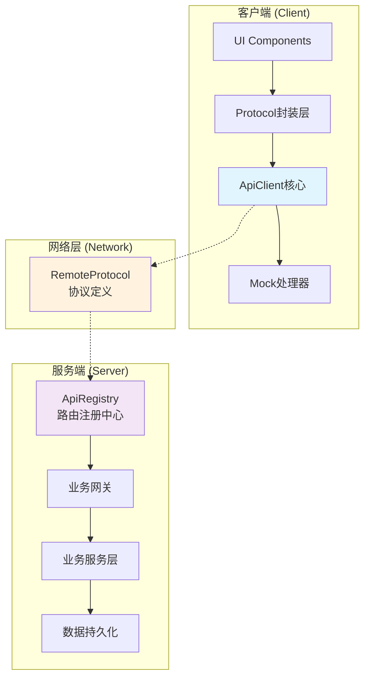

# 网络通信框架

本文档介绍基于 roblox-ts 和 Flamework 的企业级网络通信框架，提供类型安全、高性能的客户端-服务端通信解决方案。

## 框架特点

### 核心优势

- **类型安全**: 端到端 TypeScript 类型检查，编译时错误发现
- **RESTful 风格**: 采用 URI 路径标识 Protocol，符合 Web 开发习惯  
- **装饰器驱动**: 自动注册和路由管理，零配置开发体验
- **Mock 友好**: 内置开发调试和测试支持
- **高性能**: 基于 [remo](https://github.com/littensy/remo) 优化的网络传输

### 通信模式

| 模式 | 方向 | 响应 | 用途 | 示例 |
|------|------|------|------|------|
| **Protocol** | 客户端 → 服务端 | ✅ | 业务请求，类似 HTTP Protocol | 购买商品、获取数据 |
| **Event** | 客户端 → 服务端 | ❌ | 单向事件通知 | 玩家行为上报 |
| **Notification** | 服务端 → 客户端 | ❌ | 服务端主动通知 | 升级提醒、系统公告 |
| **Broadcast** | 服务端 → 多客户端 | ❌ | 广播事件 | 全服活动、排行榜 |

> 🚫 **架构约束**: 禁用服务端向客户端发起请求模式，确保清晰的数据流向

## 框架架构

### 整体架构图



### 核心组件

```typescript
// 框架分层架构  
NetworkFramework
├── 客户端层 (Client Layer)
│   ├── ApiClient           // 核心客户端类
│   ├── Protocol封装层           // 业务Protocol封装
│   └── Mock处理器          // 开发调试支持
├── 协议层 (Protocol Layer)  
│   ├── RemoteProtocol      // 通信协议定义
│   └── 类型定义            // 共享类型声明
└── 服务端层 (Server Layer)
    ├── ApiRegistry         // 路由注册中心
    ├── 业务网关            // 按域划分的网关
    └── 装饰器系统          // 自动注册机制
```

## Protocol 通信机制

### 设计理念

框架采用 **类 Web Protocol** 设计模式，具备以下特征：

1. **URI 路径标识**: 使用语义化路径标识 Protocol 接口
2. **单一参数模式**: 每个 Protocol 接受单个 payload 参数（支持多参数展开）
3. **统一响应格式**: 标准化的 `ApiResponse<T>` 响应结构
4. **类型推断**: 自动推断请求参数和响应类型

### 基本用法示例

```typescript
// 📱 客户端：类型安全的Protocol调用
const response = await apiClient.sendRequest<ShopPurchaseResponse>(
    "shop/purchase-item", 
    {
        itemId: "legendary_sword_001",
        quantity: 1,
        useDiscount: true
    }
);

if (response.success) {
    console.log("购买成功:", response.data?.newBalance);
} else {
    console.error("购买失败:", response.error);
}

// 🖥️ 服务端：装饰器驱动的网关
@Gateway()
export class ShopGateway extends ApiGateway {
    constructor(
        private shopService: ShopService,
        private playerService: PlayerService
    ) { super(); }
    
    /**
     * 购买商品 Protocol
     * URI: shop/purchase-item
     */
    "shop/purchase-item"(
        player: Player, 
        payload: ShopPurchasePayload
    ): ShopPurchaseResponse {
        // 业务逻辑处理
        const result = this.shopService.purchaseItem(player, payload);
        return {
            success: true,
            data: { newBalance: result.balance }
        };
    }
}
```

### RemoteProtocol 规范

```typescript
// shared/remotes/namespaces/api.ts
const apiMiddleware: RemoteMiddleware = (nextFunc, _remote) => {
    return (...args: Array<unknown>) => {
        // 请求预处理、日志记录、错误处理
        const startTime = tick();
        const result = nextFunc(...args) as ApiResponse<unknown>;
        const duration = tick() - startTime;
        
        if (result.success) {
            print(`✅ Protocol Success - Duration: ${duration}s`);
        } else {
            warn(`❌ Protocol Error: ${result.error}`);
        }
        
        return result;
    };
};

export const apiRemote = namespace({
    request: remote<Server, [uri: string, payload: unknown]>()
        .middleware(apiMiddleware)
        .returns<ApiResponse<unknown>>(),
});
```

### 统一响应格式

```typescript
// 标准 Protocol 响应接口
interface ApiResponse<T> {
    success: boolean;           // 请求成功标志
    data?: T;                  // 响应数据 (泛型支持)
    error?: string;            // 错误信息
    code?: number;             // 错误代码 (可选)
    timestamp?: number;        // 响应时间戳 (可选)
}

// 分页响应扩展
interface ApiPageResponse<T> extends ApiResponse<T[]> {
    pagination: {
        total: number;
        page: number;
        pageSize: number;
        hasNext: boolean;
    };
}
```


## Event 与 Notification

### 事件通信

```typescript
// 客户端发送事件 (单向)
remotes.events.playerAction.fire({
    action: "skill_used",
    skillId: "fireball",
    targetPosition: new Vector3(10, 0, 15),
    timestamp: tick()
});

// 服务端处理事件
remotes.events.playerAction.connect((player, payload) => {
    this.battleLogger.logPlayerAction(player, payload);
});
```

### 通知推送

```typescript  
// 服务端向客户端推送通知
remotes.notifications.levelUp.fire(player, {
    newLevel: 25,
    unlockedFeatures: ["pvp_mode", "guild_system"],
    rewards: [
        { type: "currency", id: "gold", amount: 1000 },
        { type: "item", id: "rare_gem", amount: 5 }
    ]
});

// 客户端接收通知
remotes.notifications.levelUp.connect((payload) => {
    this.uiManager.showLevelUpModal(payload);
    this.audioManager.playSound("level_up");
});
```

## 开发工具

### Mock 系统

```typescript
// 🧪 开发环境 Mock 配置
if (RunService.IsStudio()) {
    apiClient.mockRequest("shop/get-items", () => ({
        success: true,
        data: {
            items: [
                { id: "sword_001", name: "钢剑", price: 100, inStock: true },
                { id: "potion_001", name: "治疗药水", price: 50, inStock: false }
            ]
        }
    }));
    
    // 模拟网络延迟
    apiClient.mockRequest("player/save-progress", async (payload) => {
        await Promise.delay(2000); // 2秒延迟
        return { success: true };
    });
}
```

### Storybook 集成

```typescript
// 📚 UI组件测试的Mock配置  
export const ShopComponentStory = {
    decorators: [
        (Story: any) => {
            const mockApiClient = new ApiClient(createMockPlayer());
            
            // 配置组件所需的Protocol Mock
            mockApiClient.mockRequest("shop/get-featured-items", () => ({
                success: true,
                data: generateMockShopItems(10)
            }));
            
            return <ApiProvider client={mockApiClient}><Story /></ApiProvider>;
        }
    ]
};
```

### 调试增强

```typescript
// 🔍 调试模式配置
export class ApiClient {
    private debugMode = RunService.IsStudio();
    
    public async sendRequest<T>(uri: string, ...payload: Array<unknown>): Promise<ApiResponse<T>> {
        if (this.debugMode) {
            console.group(`🌐 Protocol Request: ${uri}`);
            console.log("Payload:", payload);
            console.time("Request Duration");
        }
        
        try {
            const result = await this.performRequest<T>(uri, payload);
            
            if (this.debugMode) {
                console.log("Response:", result);
                console.timeEnd("Request Duration");
                console.groupEnd();
            }
            
            return result;
        } catch (error) {
            if (this.debugMode) {
                console.error("Request Failed:", error);
                console.timeEnd("Request Duration");
                console.groupEnd();
            }
            throw error;
        }
    }
}
```

## 最佳实践

### 1. URI 命名规范

```typescript
// ✅ 推荐的命名模式
"shop/get-items"              // 获取商品列表
"shop/purchase-item"          // 购买单个商品
"player/update-profile"       // 更新玩家资料
"battle/create-session"       // 创建战斗会话
"guild/invite-member"         // 邀请公会成员

// ❌ 避免的命名模式  
"getShopItems"                // 非RESTful风格
"shop_purchase_item"          // 使用下划线
"shop/buyItem"                // 驼峰命名
"shopPurchase"                // 缺少上下文
```

### 2. 网关组织策略

```typescript
// ✅ 按业务域划分网关
├── ShopGateway              // 商店相关Protocol
├── PlayerGateway            // 玩家数据Protocol  
├── BattleGateway            // 战斗系统Protocol
├── GuildGateway             // 公会功能Protocol
└── AdminGateway             // 管理员Protocol

// ❌ 避免单一巨型网关
├── GameGateway              // 包含所有业务逻辑 (维护困难)
```

### 3. 类型定义管理

```typescript
// ✅ 分离类型定义到独立文件
// types/api/shop.d.ts  
export interface ShopPurchasePayload {
    itemId: string;
    quantity: number;
    useDiscount?: boolean;
}

export interface ShopPurchaseResponse {
    success: boolean;
    data?: {
        transactionId: string;
        newBalance: number;
        purchasedItems: Item[];
    };
    error?: string;
}

// 业务代码中引用
import type { ShopPurchasePayload, ShopPurchaseResponse } from "types/api/shop";
```

## 性能优化

### 1. 请求批处理

```typescript
// 批量Protocol请求优化
class BatchApiClient {
    private batchQueue: Map<string, unknown[]> = new Map();
    private batchTimer?: Timer;
    
    public batchRequest(uri: string, payload: unknown): Promise<ApiResponse<unknown>> {
        return new Promise((resolve) => {
            // 将请求加入批处理队列
            this.addToBatch(uri, payload, resolve);
            this.scheduleBatchExecution();
        });
    }
    
    private scheduleBatchExecution(): void {
        if (this.batchTimer) return;
        
        this.batchTimer = Promise.delay(50).then(() => {
            this.executeBatch();
            this.batchTimer = undefined;
        });
    }
}
```

### 2. 响应缓存

```typescript
// Protocol响应缓存机制
class CachedApiClient extends ApiClient {
    private cache = new LRUCache<string, ApiResponse<unknown>>(100);
    
    public async sendRequest<T>(
        uri: string, 
        ...payload: Array<unknown>
    ): Promise<ApiResponse<T>> {
        const cacheKey = `${uri}:${JSON.stringify(payload)}`;
        
        // 检查缓存
        if (this.isCacheable(uri)) {
            const cached = this.cache.get(cacheKey);
            if (cached) return cached as ApiResponse<T>;
        }
        
        const result = await super.sendRequest<T>(uri, ...payload);
        
        // 缓存成功响应
        if (result.success && this.isCacheable(uri)) {
            this.cache.set(cacheKey, result);
        }
        
        return result;
    }
}
```

## 相关文档

- **[Protocol 网关实现](051_api-gateway.md)** - 服务端网关架构详解
- **[Protocol 客户端](052_api-client.md)** - 客户端调用机制说明

## 扩展阅读

- [Flamework 依赖注入](https://flamework.fireboltofdeath.dev/docs/guides/dependency-injection)
- [remo 网络库文档](https://github.com/littensy/remo)
- [TypeScript 高级类型](https://www.typescriptlang.org/docs/handbook/advanced-types.html)


