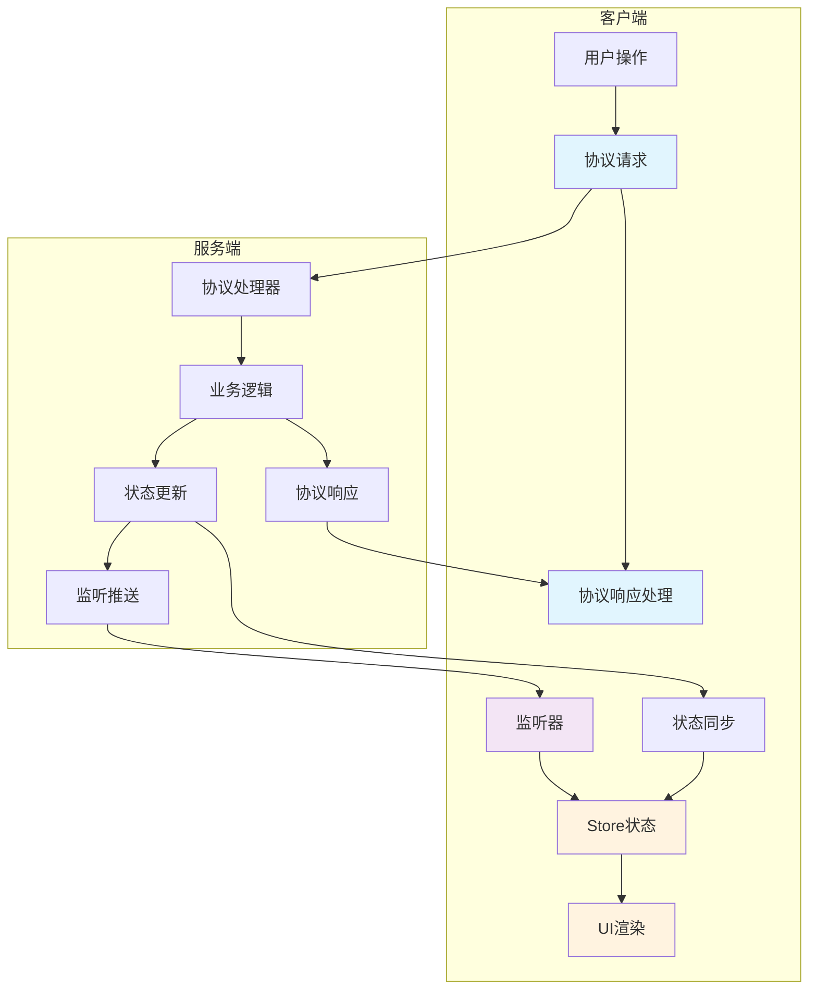

# Protocol 架构设计指南

## 概述

基于 **API First** 设计理念的现代游戏客户端-服务端通信架构。本框架超越了传统的网络通信概念，将通信协议（Protocol）定义为包含请求-响应、监听推送和状态同步三种通信模式的完整解决方案。

## Protocol 层职责边界

### Protocol 层是什么

Protocol 层专注于定义**数据传输格式**，即"传什么数据"，而不是"怎么处理数据"。

在 protocol 层，我们应该定义**客户端视角的数据结构**，因为这是通信协议的一部分。服务端如何组织数据是实现细节。

但 protocol 层, 我们`不应该`定义**UI的数据结构**, protocol 层提供的是 **客户端看到的,且由服务端产生的数据结构**

**Protocol 层应该包含：**
- ✅ 数据结构定义（请求/响应的 payload 格式）
- ✅ 实体类型定义（如 Resource、Item 等数据模型）
- ✅ 状态同步的数据结构（Store State 定义）
- ✅ 枚举类型定义（如 ResourceType、ErrorCode）
- ✅ 通信端点定义（API 路径、监听器名称）

**Protocol 层不应该包含：**
- ❌ 操作方法定义（如 addResource()、removeResource()）
- ❌ 业务逻辑接口（如 IResourceService、IShopService）
- ❌ 数据查询接口
- ❌ 具体的实现代码
- ❌ 依赖注入相关的装饰器或服务定义

### 通用层模块的特殊性

对于通用层模块（如 resource、player 等基础模块）：
- **不需要** api.d.ts 和 listener.d.ts 文件
- **只需要** entities.d.ts 定义基础数据结构
- **可选** state.d.ts 如果需要状态同步

### 示例对比

```typescript
// ✅ 正确：Protocol 层定义数据结构
export interface ResourceInventoryDelta {
    inventoryId: string;
    positive?: boolean;
    resource: ResourceInstance;
}

// ❌ 错误：Protocol 层不应定义操作接口
export interface IResourceOperations {
    addResources(delta: ResourceInventoryDelta): void;
    removeResources(delta: ResourceInventoryDelta): boolean;
}
```

操作接口应该在 Service/Controller 层定义：
```typescript
// 在 server/services/resource/resource-service.ts 中
@Service()
export class ResourceService {
    addResources(player: Player, delta: ResourceInventoryDelta): void {
        // 具体实现
    }
}
```

## API First 设计理念

### 核心原则

1. **设计先行**：在编码之前完整定义所有通信协议接口
2. **类型安全**：使用 TypeScript 确保编译时类型检查
3. **文档即代码**：类型定义本身就是最准确的协议文档
4. **模式协调**：三种通信模式有机结合，相互补充

### 三种通信模式

现代游戏通信包含三种核心模式：



#### 1. API 模式 (API)

**适用场景**：用户主动发起的操作，需要明确的执行结果

- 购买商品、创建战斗会话、更新玩家资料
- 特点：同步执行，有明确的成功/失败响应
- 实现：基于 RemoteFunction 的 API 调用

```typescript
/** 武器模块 API 定义 */
export interface WeaponRequests {
	"weapon/combine": {
		errors: {
			[400]: "参数错误";
			[404]: "武器不存在";
			[701]: "材料不足";
		};
		requestDto: {
			/** 材料武器实例ID列表（通常需要2个相同武器） */
			materialWeaponIds: Array<string>;
		};
		responseData: {
			/** 消耗的武器实例ID */
			consumedWeaponIds: Array<string>;
			/** 新生成的武器实例ID */
			newWeaponInstanceId: string;
		};
	};
}

// 无响应数据，返回 undefined
```

**API 响应简化原则**
- 只返回操作结果（成功/失败）
- 只返回资源变化（消耗/获得）
- 不返回可通过 Store 获取的数据

#### 2. 监听模式 (Listener)

**适用场景**：客户端监听服务端主动推送的实时更新

- 库存变化通知、促销活动、玩家上线提醒
- 特点：异步单向，实时性强，无需响应
- 实现：基于 RemoteListener 的监听机制

```typescript
// 示例：监听库存变化
listenerClient.on<ShopListener.StockChangedPayload>("shop/stock-changed", payload => {
	updateItemStock(payload.itemId, payload.newStock);
});
```

#### 3. 同步模式 (Sync)

**适用场景**：需要在客户端和服务端间自动同步的状态数据

- 购物车内容、玩家背包、公会信息
- 特点：自动同步，跨设备一致，无需手动管理
- 实现：基于 Reflex Store 的状态管理

```typescript
// 示例：状态自动同步
const shopState: ShopStore.ShopState = useShopStore();
// shopState.cart 会自动与服务端同步
```

## 架构组件

### 目录结构

所有通信协议类型定义统一放置在 `src/types/protocol` 目录，采用**"通用系统 + 业务模块"**的混合组织理念：

```
src/types/protocol/
├── common/                    # 通用类型定义
│   ├── base.d.ts             # 基础响应类型
│   ├── error.d.ts            # 错误代码定义
│   └── pagination.d.ts       # 分页相关类型
├── shop/                     # 商店模块
│   ├── index.d.ts           # 模块导出
│   ├── api.d.ts             # API 模式接口
│   ├── listener.d.ts        # 监听器定义
│   ├── store.d.ts           # 同步模式数据
│   └── entities.d.ts        # 共享实体定义
├── player/                   # 玩家模块
├── battle/                   # 战斗模块
├── guild/                    # 公会模块
└── index.d.ts               # 总导出文件
```

### 组织理念说明

此目录结构遵循**"通用系统 + 业务模块"**的组织理念：

#### 1. 通用系统层 (`common/`)

承担跨模块的系统性功能，避免在每个业务模块中重复定义：

- **基础响应类型**：统一的协议响应格式
- **错误处理系统**：全局错误代码与处理机制
- **分页系统**：通用的分页逻辑与类型定义

#### 2. 业务模块层 (`shop/`, `player/`, `battle/`, `guild/`)

按照**领域驱动设计（DDD）**的理念，以业务边界划分模块：

- **业务内聚**：同一业务功能的所有类型定义集中管理
- **模块独立**：每个模块可以独立开发、测试和维护
- **查找便利**：开发者能快速定位到特定业务的类型定义
- **扩展性好**：新增业务模块只需添加新目录

这种组织方式既保持了**系统架构的清晰性**，又确保了**业务逻辑的内聚性**，避免了过度嵌套带来的复杂性。

### 模块设计模式

每个业务模块都*可以*包含四个核心文件：

```typescript
// 模块导出文件 - shop/index.d.ts
export * as Api from "./api"; // API 模式接口
export * as Listener from "./listener"; // 监听器定义
export * as Store from "./store"; // 同步模式数据
export * from "./entities"; // 共享实体定义

// 使用时通过模块导入
import * as Shop from "../shop";
// 使用: Shop.Api.PurchaseItemPayload
// 使用: Shop.Store.ShopState
```

其中, api 和 listener 不是必须的.

## 开发工作流

### 1. 需求分析阶段

**确定通信模式**：分析每个功能点应该使用哪种通信模式

```typescript
// 需求：用户购买商品
// 分析：
// - 用户点击购买按钮 → API 模式（需要确认结果）
// - 库存变化通知其他用户 → 监听模式（实时通知）
// - 用户余额变化 → 状态同步模式（跨设备同步）
```

### 2. 协议设计阶段

**创建类型定义**：按照规范创建完整的类型定义

```typescript
// 1. 定义实体类型
export interface ShopItem {
	id: string;
	name: string;
	price: number;
	// ...
}

// 2. 定义协议接口
export interface PurchaseItemPayload {
	itemId: string;
	quantity: number;
}

export interface PurchaseItemResponse
	extends ApiResponse<{
		transactionId: string;
		newBalance: number;
	}> {}

// 3. 定义监听类型
export interface StockChangedPayload {
	itemId: string;
	newStock: number;
}

// 4. 定义状态数据
export interface ShopState {
	items: Record<string, ShopItem>;
	cart: ShoppingCart;
	balance: UserBalance;
}
```

### 3. 协调设计阶段

**定义模式间的协调关系**：确保三种模式协同工作

```typescript
/**
 * 购买商品的完整流程协调
 */

// 1. 用户发起购买请求（API 模式）
const purchaseResponse = await apiClient.request<ShopApi.PurchaseItemResponse>(
	"shop/purchase-item",
	{ itemId: "sword_001", quantity: 1 },
);

// 2. 服务端处理后推送库存变化（监听模式）
// 客户端监听并处理库存变化通知

// 3. 用户余额和购物车自动同步（同步模式）
// ShopStore.ShopState 会自动更新
```

### 4. 实现阶段

**并行开发**：前端后端基于类型定义并行开发

```typescript
// 前端：基于类型定义创建 Mock 数据
const mockShopProtocol = {
	"shop/purchase-item": (payload: ShopProtocol.PurchaseItemPayload) => ({
		success: true,
		data: {
			transactionId: "mock_transaction",
			newBalance: 1000 - payload.quantity * 100,
		},
	}),
};

// 后端：实现符合类型定义的接口
@Gateway()
export class ShopGateway {
	"shop/purchase-item"(
		player: Player,
		payload: ShopApi.PurchaseItemPayload,
	): ShopProtocol.PurchaseItemResponse {
		// 实现购买逻辑
		return {
			success: true,
			data: {
				transactionId: generateTransactionId(),
				newBalance: newPlayerBalance,
			},
		};
	}
}
```

## 最佳实践

### 1. 类型定义规范

```typescript
// ✅ 推荐：清晰的命名和文档
/**
 * 购买商品协议
 *
 * @uri shop/purchase-item
 * @description 用户购买指定商品，支持批量购买和折扣
 */
export interface PurchaseItemPayload {
	/** 商品ID */
	itemId: string;
	/** 购买数量，默认为 1 */
	quantity: number;
	/** 是否使用可用折扣，默认为 false */
	useDiscount?: boolean;
}

// ❌ 避免：不清晰的命名
export interface BuyReq {
	id: string;
	num: number;
}
```

### 2. 错误处理策略

```typescript
// 统一的错误响应格式
export interface ApiErrorResponse extends ApiResponse<never> {
	success: false;
	error: string;
	code: ApiErrorCode;
	details?: Record<string, unknown>;
}

// 业务特定的错误代码
export enum ShopErrorCode {
	INSUFFICIENT_BALANCE = 601,
	ITEM_OUT_OF_STOCK = 602,
	INVALID_QUANTITY = 603,
}
```

## 文档编写指南

### TypeScript 文档的特殊性

使用 TypeScript 作为通信协议文档定义时，需要特别注意模块间的依赖关系。如果模块 A 引用了模块 B 的类型，则模块 B 必须先编写完成，否则 TypeScript 编译会失败。

### 推荐的编写顺序

#### 第一批：通用类型模块

通用类型模块不需要网络交互, 不需要 api 和 listener

```bash
# 这些模块相互独立，可以并行编写
1. common/base.d.ts        # 基础响应类型
2. common/error.d.ts       # 错误代码定义
3. common/pagination.d.ts  # 分页类型
4. player/entities.d.ts    # 玩家基础类型
5. item/entities.d.ts      # 物品基础类型
```

#### 第二批：业务模块

```bash
# 依赖第一批的基础类型
6. shop/   # 商店模块（可能引用 player, item）
7. battle/ # 战斗模块（可能引用 player, item）
8. guild/  # 公会模块（可能引用 player）
```

#### 第三批：复杂集成

```bash
# 依赖多个业务模块
9. guild-war/        # 公会战（引用 guild, battle）
10. cross-server/    # 跨服活动（引用多个模块）
```

### 处理并行开发

如果团队需要并行开发不同模块，可以采用以下策略：

1. **提前定义接口契约**：先定义好各模块会暴露的基础类型
2. **使用临时占位符**：创建临时的类型定义，后续替换
3. **分离基础类型**：将可能被引用的类型单独抽离到 `basic-types.d.ts`

## 相关文档

- **[协议设计指南](protocol-design-guide.md)** - 详细的协议设计方法论
- **[依赖管理](protocol-dependency-management.md)** - TypeScript 文档的依赖管理策略
- **[命名规范](protocol-naming-conventions.md)** - URI、监听器、类型的命名约定
- **[Store 设计](protocol-store-design.md)** - 状态同步数据结构设计
- **[模板示例](examples/)** - 完整的商店系统设计示例
- **[错误代码](protocol-error-codes.md)** - 统一的错误代码定义
- **[协议审核](protocol-review.md)**

## 总结

本通信协议架构框架通过 TypeScript 类型定义实现了：

1. **统一的设计语言**：三种通信模式的有机结合
2. **类型安全保障**：编译时错误检查，减少运行时问题
3. **高效的开发流程**：前后端并行开发，文档永远同步
4. **可扩展的架构**：支持从简单功能到复杂分布式场景

这种 API First 的设计理念确保了游戏系统的一致性、可维护性和可扩展性，是现代游戏开发的最佳实践。
