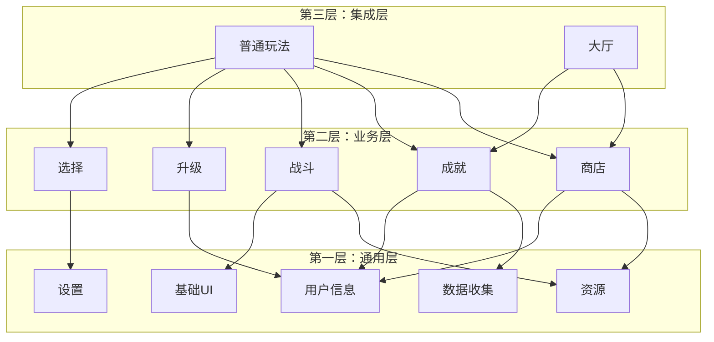

# Protocol 依赖管理指南

## 概述

本文档专门介绍在使用 TypeScript 作为 Protocol 文档定义时的依赖管理策略。由于 TypeScript 的编译时类型检查特性，模块间的依赖关系直接影响文档的编写顺序和系统的可维护性。

## 依赖管理核心原则

### 1. 分层架构原则



### 2. 单向依赖原则

- **向下依赖**：上层模块可以依赖下层模块
- **禁止向上**：下层模块不能依赖上层模块
- **同层谨慎**：同层模块应避免相互依赖

### 3. 显式依赖原则

```typescript
// ✅ 推荐：明确的依赖声明
import { ApiResponse } from '../common/base';
import { UserInfo } from '../user-info/entities';

// ❌ 避免：隐式使用未导入的类型
export interface ShopPurchase {
  buyer: UserInfo.UserInfo;  // 未导入 UserInfo
}
```

## 文档编写工作流

### 阶段一：基础层模块

编写顺序和检查清单：

#### 1. 基础响应类型 (`common/base.d.ts`)
```bash
# 检查项目
□ 定义 ApiResponse<T> 接口
□ 定义 ApiPageResponse<T> 接口  
□ 定义 ApiErrorResponse 接口
□ 无外部依赖
□ 通过 TypeScript 编译检查
```

#### 2. 错误代码定义 (`common/error.d.ts`)
```bash
# 检查项目
□ 定义 ApiErrorCode 枚举
□ 定义业务错误码范围
□ 可能依赖 base.d.ts 中的错误响应类型
□ 通过编译检查
```

#### 3. 分页工具类型 (`common/pagination.d.ts`)
```bash
# 检查项目
□ 定义分页参数接口
□ 定义分页响应接口
□ 依赖 base.d.ts 的基础类型
□ 通过编译检查
```

### 阶段二：核心业务模块

#### 编写顺序建议

1. **用户信息模块** (`user-info/`)
   - 原因：其他模块频繁引用用户相关类型
   - 依赖：仅依赖 `common/` 模块

2. **商店模块** (`shop/`)
   - 原因：相对独立，依赖较少
   - 依赖：`common/` + 可能的 `player/` 基础类型

3. **战斗模块** (`battle/`)
   - 原因：可能引用玩家和装备相关类型
   - 依赖：`common/` + `player/` + 可能的 `shop/` 物品类型

4. **成就模块** (`achievement/`)
   - 原因：需要记录用户成就进度
   - 依赖：`common/` + `user-info/`

#### 业务模块检查清单

```bash
# 每个业务模块完成后检查
□ entities.d.ts - 共享实体定义完整
□ api.d.ts - 请求响应接口完整
□ events.d.ts - 监听事件类型完整
□ store.d.ts - 状态同步类型完整
□ index.d.ts - 模块导出配置正确
□ 所有依赖模块已存在
□ 无循环依赖
□ 通过 TypeScript 编译
□ 符合命名规范
```

### 阶段三：集成场景模块

复杂场景通常需要引用多个业务模块：

```typescript
// 例：普通玩法可能依赖多个模块
import { UserInfo } from '../user-info/entities';
import { ShopItem } from '../shop/entities';
import { Achievement } from '../achievement/entities';
import { BattleResult } from '../battle/entities';
```

## 依赖关系实战分析

### 示例：商店模块依赖分析

```typescript
// src/types/api/shop/api.d.ts
import { ApiResponse, ApiPageResponse } from '../common/base';  // ✅ 基础层依赖
import { UserInfo } from '../user-info/entities';                    // ✅ 同层依赖（谨慎）

// shop/api.d.ts
export interface PurchaseItemPayload {
  userId: UserInfo.UserId;    // 依赖用户信息模块
  itemId: string;
  quantity: number;
}
  
  export interface PurchaseItemResponse extends ApiResponse<{
    transaction: TransactionInfo;
    newBalance: number;
  }> {}
}
```

**依赖检查：**
- `common/base` ✅ 已存在
- `user-info/entities` ❓ 需要确认用户信息模块已完成
- 无循环依赖 ✅ 用户信息模块不引用商店类型

### 示例：战斗模块依赖分析

```typescript
// src/types/api/battle/api.d.ts
import { ApiResponse } from '../common/base';
import { UserInfo } from '../user-info/entities';
import { ShopItem } from '../shop/entities';  // 装备可能来自商店

// battle/api.d.ts
export interface CreateSessionPayload {
  users: UserInfo.UserId[];
  equipment: ShopItem.ItemId[];  // 依赖商店模块
}
```

**依赖检查：**
- `common/base` ✅ 
- `user-info/entities` ✅
- `shop/entities` ❓ 需要确认商店模块已完成
- 潜在问题：如果商店模块引用战斗类型会形成循环依赖

## 循环依赖解决策略

### 1. 提取共享基础类型

当两个模块相互依赖时，提取共享类型到更底层：

```typescript
// 创建 src/types/api/shared/basic-types.d.ts
export type UserId = string;
export type ItemId = string;
export type TransactionId = string;

export interface Timestamp {
  createdAt: number;
  updatedAt: number;
}
```

然后各模块引用基础类型：

```typescript
// shop/api.d.ts
import * as BasicTypes from '../shared/basic-types';

export interface PurchaseRecord {
  userId: BasicTypes.UserId;  // 不直接依赖 user-info 模块
  itemId: BasicTypes.ItemId;
}
```

### 2. 使用类型合成避免直接依赖

```typescript
// battle/api.d.ts
export interface BattleUser {
  // 不直接引用 UserInfo.UserInfo，而是重新定义需要的字段
  userId: string;
  userName: string;
  level: number;
  // 战斗特有的字段
  battleStats: BattleStats;
}
```

### 3. 延迟绑定策略

```typescript
// 在运行时绑定详细类型，编译时只使用 ID
export interface ShopPurchase {
  buyerId: string;           // 编译时：字符串 ID
  // buyerInfo?: UserInfo.UserInfo;  // 运行时：可选的详细信息
}
```

## 依赖验证工具

### 1. TypeScript 编译检查

```bash
# 检查特定模块的编译
npx tsc --noEmit src/types/api/shop/*.d.ts

# 检查整个 Protocol 类型系统
npx tsc --noEmit src/types/api/**/*.d.ts
```

### 2. 依赖分析脚本

```typescript
// tools/analyze-dependencies.ts
import * as ts from 'typescript';
import * as fs from 'fs';
import * as path from 'path';

interface DependencyGraph {
  [moduleName: string]: string[];
}

export function analyzeDependencies(apiDir: string): DependencyGraph {
  const graph: DependencyGraph = {};
  
  // 扫描所有 .d.ts 文件
  const files = fs.readdirSync(apiDir, { recursive: true })
    .filter(file => file.endsWith('.d.ts'));
  
  for (const file of files) {
    const content = fs.readFileSync(path.join(apiDir, file), 'utf-8');
    const imports = extractImports(content);
    
    const moduleName = path.dirname(file);
    graph[moduleName] = imports;
  }
  
  return graph;
}

function detectCircularDependencies(graph: DependencyGraph): string[][] {
  // 实现循环依赖检测算法
  // 返回发现的循环依赖路径
}
```

### 3. 依赖关系可视化

```bash
# 生成依赖关系图
npm run analyze-deps -- --output dependency-graph.svg
```

## 版本兼容性管理

### 1. 语义化版本控制

```typescript
// src/types/api/version.d.ts
export const Protocol_VERSION = {
  major: 1,      // 破坏性变更
  minor: 2,      // 向后兼容的功能新增  
  patch: 3       // 向后兼容的错误修复
} as const;

export type ApiVersion = typeof Protocol_VERSION;
```

### 2. 接口演进策略

```typescript
// shop/v2/api.d.ts - 新版本保持向后兼容
import * as V1 from '../v1/api';

export interface PurchaseItemPayload extends V1.PurchaseItemPayload {
  // 新增字段使用可选
  preferences?: PurchasePreferences;
}

// shop/index.d.ts - 提供版本映射
export * as V1 from './v1';
export * as V2 from './v2';
export * as Latest from './v2';  // 指向最新版本
```

### 3. 废弃字段管理

```typescript
export interface UserInfo {
  id: string;
  name: string;
  
  /** @deprecated 使用 level 替代 */
  userLevel?: number;
  
  level: number;  // 新字段
}
```

## 最佳实践总结

### 1. 设计阶段

- 绘制模块依赖图，识别潜在的循环依赖
- 优先设计基础层，确保稳定的依赖基础
- 评估跨模块依赖的必要性

### 2. 开发阶段  

- 严格按照依赖层次编写文档
- 每完成一个模块立即进行编译检查
- 使用工具检测循环依赖

### 3. 维护阶段

- 定期检查依赖关系变化
- 控制依赖复杂度，避免过度耦合
- 保持向后兼容性

### 4. 协作规范

- 团队成员必须了解依赖层次
- 跨模块变更需要评估影响范围
- 建立依赖变更的审查流程

通过这套依赖管理体系，可以确保 TypeScript Protocol 文档系统的稳定性、可维护性和可扩展性。