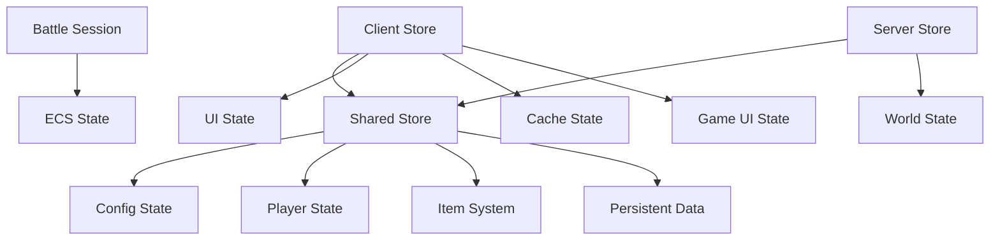
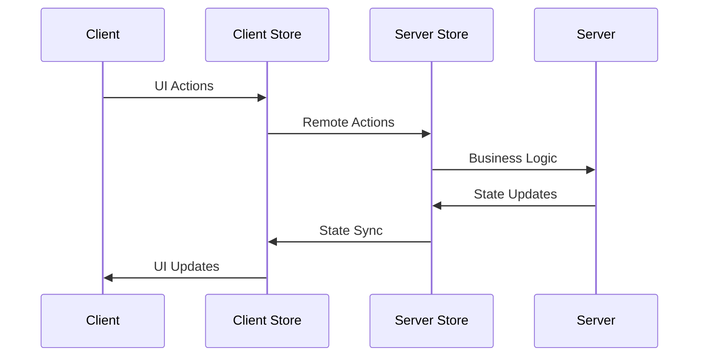

# 状态管理系统

## 概述

本项目使用 [Reflex](https://littensy.github.io/reflex/) 作为状态管理库，采用基于 Redux 模式的状态管理架构。状态管理系统分为三个层级，实现了客户端与服务端状态的统一管理和同步。

## 核心概念

### 状态管理架构

项目采用三层状态管理架构：

- **共享状态层 (shared/store)** - 客户端和服务端共享的核心业务状态
- **客户端状态层 (client/store)** - 客户端专用的UI和缓存状态  
- **服务端状态层 (server/store)** - 服务端专用的世界状态和数据管理

### 关键特性

1. **类型安全** - 完整的 TypeScript 类型定义和约束
2. **状态同步** - 客户端与服务端自动状态同步
3. **模块化设计** - 按功能域划分的状态模块
4. **中间件支持** - 支持日志记录、状态广播等中间件

## 架构设计

### 状态层级结构



### 数据流向



## 实现指南

### 基础用法

#### 1. 创建状态切片

```typescript
// shared/store/example/slice.ts
import { createProducer } from "@rbxts/reflex";
import { initialExampleState } from "./types";

export const exampleSlice = createProducer(initialExampleState, {
    /**
     * 更新数值
     * @param state 当前状态
     * @param value 新数值
     */
    updateValue: (state, value: string) => ({
        ...state,
        value,
        updatedAt: os.time(),
    }),
    
    /**
     * 重置状态
     * @param state 当前状态
     */
    resetState: (state) => ({
        ...initialExampleState,
    }),
});
```

#### 2. 定义状态选择器

```typescript
// shared/store/example/selectors.ts
import type { RootState } from "../types";

/** 状态约束接口 */
interface StateWithExample {
    example: {
        value: string;
        isLoading: boolean;
    };
}

/**
 * 选择示例数值
 * @param state 根状态
 */
export function selectExampleValue(state: StateWithExample): string {
    return state.example.value;
}

/**
 * 选择加载状态
 * @param state 根状态
 */
export function selectIsExampleLoading(state: StateWithExample): boolean {
    return state.example.isLoading;
}
```

#### 3. 在组件中使用状态

```typescript
// client/ui/components/example-component.tsx
import { useSelector } from "@rbxts/react-reflex";
import { selectExampleValue } from "shared/store/example/selectors";

export function ExampleComponent() {
    const value = useSelector(selectExampleValue);
    
    return <textlabel Text={value} />;
}
```

### 高级用法

#### 1. 状态同步中间件

```typescript
// client/store/middleware/receiver.ts
export function receiverMiddleware(): ProducerMiddleware {
    const receiver = createBroadcastReceiver({
        start: () => {
            remotes.store.start.fire();
        },
    });

    // 监听服务端actions分发
    remotes.store.dispatch.connect(actions => {
        receiver.dispatch(actions);
    });

    // 监听状态同步
    remotes.store.hydrate.connect(state => {
        receiver.hydrate(state);
    });

    return receiver.middleware;
}
```

#### 2. 服务端状态广播

```typescript
// server/store/middleware/broadcaster.ts
export function broadcasterMiddleware(): ProducerMiddleware {
    const broadcaster = createBroadcaster({
        producers: sharedSlices,
        dispatch: remotes.store.dispatch,
        hydrate: remotes.store.hydrate,
        hydrateRate: 30, // 限制同步频率
    });

    // 监听客户端连接请求
    remotes.store.start.connect(player => {
        broadcaster.start(player);
    });

    return broadcaster.middleware;
}
```

#### 3. 持久化数据管理

```typescript
// 服务端Service中使用
@Service()
export class PlayerService {
    constructor(private store: RootStore) {}
    
    /**
     * 更新玩家等级
     * @param playerId 玩家ID
     * @param newLevel 新等级
     */
    updatePlayerLevel(playerId: string, newLevel: number) {
        // 直接使用Producer方法更新状态
        this.store.levelUp(playerId, newLevel);
        
        // 获取当前状态进行业务逻辑判断
        const currentState = this.store.getState();
        const playerData = selectPlayerData(playerId)(currentState);
        
        // 触发其他业务逻辑
        this.triggerLevelUpRewards(playerId, newLevel);
    }
    
    /**
     * 批量更新玩家数据
     * @param playerId 玩家ID
     * @param updates 更新数据
     */
    batchUpdatePlayer(playerId: string, updates: PlayerDataUpdate) {
        this.store.batchUpdate(playerId, updates);
        
        // 触发相关事件
        this.onPlayerDataChanged(playerId, updates);
    }
}
```

## API 参考

### Store 结构

#### 客户端Store类型
```typescript
export type RootStore = ReturnType<typeof combineProducers<{
    cache: typeof cacheSlice;
    config: typeof slices.config;
    gameUI: typeof gameUISlice;
    itemSystem: typeof slices.itemSystem;
    persistent: typeof slices.persistent;
    player: typeof slices.player;
    shop: typeof slices.shop;
    uiState: typeof uiStateSlice;
}>>;
```

#### 服务端Store扩展
```typescript
export interface ExtendedStore extends RootStore {
    loadPlayerData: (playerId: string, data: unknown) => void;
    closePlayerData: (playerId: string) => void;
}
```

### 核心方法

#### createProducer
```typescript
function createProducer<T>(
    initialState: T,
    actions: Record<string, (state: T, ...args: any[]) => T>
): Producer<T>
```

#### combineProducers  
```typescript
function combineProducers<T extends Record<string, Producer<any>>>(
    producers: T
): CombinedProducer<T>
```

## 最佳实践

### 1. 状态模块设计

```typescript
// ✅ 正确的模块结构
example/
├── index.ts      // 导出接口
├── types.ts      // 类型定义
├── slice.ts      // 状态切片
└── selectors.ts  // 状态选择器
```

### 2. 状态更新原则

```typescript
// ✅ 不可变更新
updatePlayer: (state, updates: Partial<PlayerData>) => ({
    ...state,
    ...updates,
    updatedAt: os.time(),
});

// ❌ 避免直接修改状态
updatePlayer: (state, updates: Partial<PlayerData>) => {
    state.name = updates.name; // 不要这样做
    return state;
};
```

### 3. 选择器使用

```typescript
// ✅ 使用参数化选择器
export function selectPlayerCurrency(playerId: string, currencyType: CurrencyType) {
    return (state: RootState): number => {
        return state.persistent.player.currency[currencyType];
    };
}

// ✅ 使用记忆化选择器提升性能
const selectExpensiveCalculation = createSelector(
    [selectPlayerStats, selectEquipmentStats],
    (playerStats, equipmentStats) => {
        // 复杂计算逻辑
        return calculateFinalStats(playerStats, equipmentStats);
    }
);
```

### 4. 类型约束

```typescript
// ✅ 严格的类型约束
interface StateWithPersistent {
    persistent: {
        player: {
            currency: PlayerCurrency;
            levelInfo: PlayerLevelInfo;
        };
    };
}
```

## 常见问题

### Q: 如何在服务端Service中更新状态？

A: 服务端Service应该直接使用store的Producer方法，并且可以同步获取当前状态：

```typescript
// ✅ 正确的服务端状态更新
export class PlayerService {
    addExperience(playerId: string, amount: number) {
        // 直接调用Producer方法
        store.addExperience(amount);
        
        // 获取当前状态进行后续逻辑
        const currentState = store.getState();
        const canLevelUp = selectCanLevelUp(playerId)(currentState);
        
        if (canLevelUp) {
            this.handleLevelUp(playerId);
        }
    }
}
```

### Q: 为什么不允许使用store.dispatch？

A: 项目规范中明确规定service直接使用store的Producer方法，这样可以：
- 确保类型安全
- 简化调用方式  
- 避免action创建的复杂性

### Q: 如何处理客户端UI状态？

A: UI界面的handle方法需要通过props传入，只允许在功能模块的主要screen中定义：

```typescript
// ✅ 在主要Screen中定义handle
export function ShopScreen() {
    const handlePurchase = useCallback((itemId: string) => {
        // handle逻辑
    }, []);
    
    return <ShopContent onPurchase={handlePurchase} />;
}

// ✅ 子组件通过props接收
interface ShopContentProps {
    onPurchase: (itemId: string) => void;
}
```

## 相关资源

- [Store模块结构规范](./075_store-structure.md)
- [状态切片设计指南](./073_slice.md)
- [选择器使用指南](./074_selector.md)
- [类型系统详解](./072_type.md)
- [Reflex官方文档](https://littensy.github.io/reflex/)

---

**状态管理系统为整个项目提供了统一、类型安全、高性能的数据管理方案。遵循本文档的最佳实践，可以确保代码的可维护性和扩展性。**