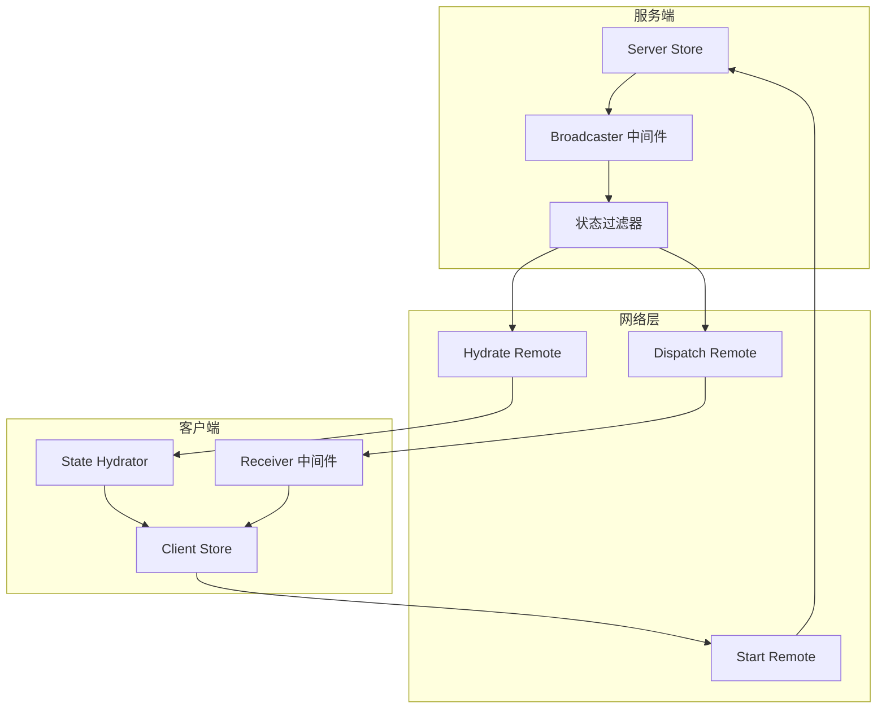

# 状态同步机制

## 概述

状态同步是分布式状态管理的核心功能，确保客户端和服务端的状态保持一致。本文档详细介绍项目中基于Reflex框架的状态同步机制，包括初始同步、增量同步、状态过滤和错误处理。

## 核心概念

### 同步架构



### 同步策略

1. **完整同步 (Hydration)** - 客户端首次连接时同步完整状态
2. **增量同步 (Dispatch)** - 状态变更时同步Action差异
3. **选择性同步** - 只同步客户端可见的状态分片
4. **频率控制** - 限制同步频率避免网络拥塞

## 服务端状态广播

### 广播中间件实现

```typescript
// server/store/middleware/broadcaster.ts
import { createBroadcaster } from "@rbxts/reflex";
import { slices } from "shared/store";
import { remotes } from "shared/remotes";

/**
 * 服务端状态广播中间件
 * 负责将状态变更推送给客户端
 */
export function broadcasterMiddleware(): ProducerMiddleware {
    const broadcaster = createBroadcaster({
        // 只广播共享状态切片
        producers: slices,
        
        // 状态同步远程调用
        dispatch: remotes.store.dispatch,
        hydrate: remotes.store.hydrate,
        
        // 同步频率限制 (每30秒最多一次完整同步)
        hydrateRate: 30,
        
        // 同步前的状态预处理
        beforeHydrate: beforeHydrate(hydrated),
        
        // 状态序列化
        beforeDispatch: (player, actions) => {
            // 记录同步的actions数量用于监控
            if (actions.length > 10) {
                warn(`Large action batch for ${player.Name}: ${actions.length} actions`);
            }
            return actions;
        },
    });

    // 监听客户端连接请求
    remotes.store.start.connect(player => {
        print(`Player ${player.Name} requesting state sync`);
        broadcaster.start(player);
    });

    // 监听玩家离开事件
    game.Players.PlayerRemoving.Connect(player => {
        broadcaster.stop(player);
        print(`Stopped state sync for ${player.Name}`);
    });

    return broadcaster.middleware;
}
```

### 状态过滤机制

服务端在同步状态时需要过滤敏感数据：

```typescript
// server/store/middleware/state-filter.ts

/**
 * 状态过滤器 - 只同步客户端需要的数据
 * @param state 完整服务端状态
 * @param playerId 目标玩家ID
 */
export function filterStateForClient(state: ServerState, playerId: string): ClientVisibleState {
    return {
        // 配置数据 - 完全可见
        config: state.config,
        
        // 物品系统 - 完全可见
        itemSystem: state.itemSystem,
        
        // 商店数据 - 完全可见
        shop: state.shop,
        
        // 玩家数据 - 只同步当前玩家的数据
        persistent: {
            player: filterPlayerData(state.persistent.player, playerId),
        },
        
        // 玩家状态 - 过滤敏感信息
        player: {
            ...state.player,
            // 移除服务端专用字段
            serverOnlyData: undefined,
        },
    };
}

/**
 * 过滤玩家数据，确保数据安全
 * @param playerData 完整玩家数据
 * @param targetPlayerId 目标玩家ID
 */
function filterPlayerData(playerData: PlayerState, targetPlayerId: string): PlayerState {
    // 只返回目标玩家自己的数据
    if (playerData.playerId !== targetPlayerId) {
        // 返回最小化的数据（比如只有显示名称）
        return {
            playerId: playerData.playerId,
            displayName: playerData.displayName,
            isOnline: playerData.isOnline,
            // 其他敏感数据设为默认值
            ...getDefaultPlayerState(),
        };
    }
    
    return playerData;
}

/**
 * 同步前的状态预处理
 */
export function beforeHydrate(hydrated: Set<Player>) {
    return (player: Player, state: SharedState): SharedState => {
        // 记录已同步的玩家
        hydrated.add(player);
        
        // 应用状态过滤
        const filteredState = filterStateForClient(state, player.UserId.toString());
        
        // 添加同步时间戳
        return {
            ...filteredState,
            _syncTimestamp: os.time(),
            _syncVersion: getCurrentSyncVersion(),
        };
    };
}
```

### 性能优化

```typescript
// server/store/middleware/sync-optimizer.ts

/**
 * 同步性能优化器
 */
export class SyncOptimizer {
    private lastSyncTime = new Map<Player, number>();
    private pendingActions = new Map<Player, BroadcastAction[]>();
    private syncTimer?: thread;
    
    /**
     * 批量处理actions，减少网络调用
     */
    public optimizeSync(player: Player, actions: BroadcastAction[]): void {
        const now = os.time();
        const lastSync = this.lastSyncTime.get(player) || 0;
        
        // 添加到待同步队列
        const pending = this.pendingActions.get(player) || [];
        pending.push(...actions);
        this.pendingActions.set(player, pending);
        
        // 如果距离上次同步时间较短，延迟同步
        const timeSinceLastSync = now - lastSync;
        if (timeSinceLastSync < SYNC_THROTTLE_TIME) {
            this.scheduleDelayedSync(player);
            return;
        }
        
        // 立即同步
        this.flushPendingActions(player);
    }
    
    private scheduleDelayedSync(player: Player): void {
        if (this.syncTimer) return;
        
        this.syncTimer = task.delay(SYNC_THROTTLE_TIME, () => {
            // 同步所有待处理的玩家
            for (const [p, actions] of this.pendingActions) {
                if (actions.length > 0) {
                    this.flushPendingActions(p);
                }
            }
            this.syncTimer = undefined;
        });
    }
    
    private flushPendingActions(player: Player): void {
        const actions = this.pendingActions.get(player);
        if (!actions || actions.length === 0) return;
        
        // 优化actions - 合并相同类型的操作
        const optimizedActions = this.mergeActions(actions);
        
        // 发送给客户端
        remotes.store.dispatch.fireFor(player, optimizedActions);
        
        // 清理
        this.pendingActions.set(player, []);
        this.lastSyncTime.set(player, os.time());
    }
    
    /**
     * 合并重复的actions以减少网络负载
     */
    private mergeActions(actions: BroadcastAction[]): BroadcastAction[] {
        const mergedMap = new Map<string, BroadcastAction>();
        
        for (const action of actions) {
            const key = `${action.name}:${action.arguments?.[0] || ''}`;
            
            // 对于某些action类型，后面的会覆盖前面的
            if (this.isMergeableAction(action.name)) {
                mergedMap.set(key, action);
            } else {
                // 其他action保持顺序
                mergedMap.set(`${key}:${mergedMap.size()}`, action);
            }
        }
        
        return Array.from(mergedMap.values());
    }
    
    private isMergeableAction(actionName: string): boolean {
        // 可以合并的action类型（新值覆盖旧值）
        const mergeableActions = [
            'updateCurrency',
            'updateLevel',
            'updateStats',
            'setOnlineStatus',
        ];
        
        return mergeableActions.includes(actionName);
    }
}
```

## 客户端状态接收

### 接收中间件实现

```typescript
// client/store/middleware/receiver.ts
import { createBroadcastReceiver } from "@rbxts/reflex";
import { remotes } from "shared/remotes";

/**
 * 客户端状态接收中间件
 * 负责接收和处理服务端的状态同步
 */
export function receiverMiddleware(): ProducerMiddleware {
    const receiver = createBroadcastReceiver({
        // 启动同步请求
        start: () => {
            print("Requesting state sync from server");
            remotes.store.start.fire();
        },
    });

    // 监听服务端actions分发
    remotes.store.dispatch.connect(actions => {
        if (actions.length > 0) {
            print(`Received ${actions.length} actions from server`);
            receiver.dispatch(actions);
        }
    });

    // 监听状态完整同步
    remotes.store.hydrate.connect(state => {
        print("Received state hydration from server");
        receiver.hydrate(state);
        
        // 触发同步完成事件
        onStateSyncComplete.fire(state);
    });

    return receiver.middleware;
}

/**
 * 状态同步完成事件
 */
export const onStateSyncComplete = new Signal<SharedState>();

/**
 * 状态同步状态管理
 */
export class SyncStateManager {
    private isInitialSyncComplete = false;
    private lastSyncTime = 0;
    private syncFailureCount = 0;
    
    constructor() {
        this.setupSyncMonitoring();
    }
    
    /**
     * 检查是否已完成初始同步
     */
    public isReady(): boolean {
        return this.isInitialSyncComplete;
    }
    
    /**
     * 获取最后同步时间
     */
    public getLastSyncTime(): number {
        return this.lastSyncTime;
    }
    
    /**
     * 重新请求状态同步
     */
    public requestResync(): void {
        print("Requesting state resync");
        this.syncFailureCount = 0;
        remotes.store.start.fire();
    }
    
    private setupSyncMonitoring(): void {
        // 监听同步完成
        onStateSyncComplete.connect(state => {
            this.isInitialSyncComplete = true;
            this.lastSyncTime = os.time();
            this.syncFailureCount = 0;
            
            // 验证同步的状态
            this.validateSyncedState(state);
        });
        
        // 监听网络连接状态
        this.setupNetworkMonitoring();
        
        // 设置同步超时检查
        this.setupSyncTimeout();
    }
    
    private validateSyncedState(state: SharedState): boolean {
        try {
            // 检查必需的状态结构
            if (!state.config || !state.persistent) {
                warn("Received incomplete state from server");
                return false;
            }
            
            // 检查数据完整性
            const hasValidPlayerData = state.persistent.player && 
                                     state.persistent.player.playerId !== "";
            
            if (!hasValidPlayerData) {
                warn("Received invalid player data from server");
                return false;
            }
            
            print("State validation passed");
            return true;
            
        } catch (error) {
            warn(`State validation failed: ${error}`);
            return false;
        }
    }
    
    private setupNetworkMonitoring(): void {
        // 监听连接中断
        game.ReplicatedStorage.ChildRemoved.Connect(child => {
            if (child.Name === "Remotes") {
                this.handleConnectionLoss();
            }
        });
    }
    
    private setupSyncTimeout(): void {
        task.delay(SYNC_TIMEOUT_SECONDS, () => {
            if (!this.isInitialSyncComplete) {
                warn("State sync timeout - requesting retry");
                this.handleSyncTimeout();
            }
        });
    }
    
    private handleConnectionLoss(): void {
        print("Connection lost - will attempt resync on reconnection");
        this.isInitialSyncComplete = false;
    }
    
    private handleSyncTimeout(): void {
        this.syncFailureCount++;
        
        if (this.syncFailureCount < MAX_SYNC_RETRIES) {
            print(`Sync timeout ${this.syncFailureCount}/${MAX_SYNC_RETRIES} - retrying`);
            task.delay(SYNC_RETRY_DELAY * this.syncFailureCount, () => {
                this.requestResync();
            });
        } else {
            warn("Max sync retries exceeded - state sync failed");
            // 触发错误处理
            onSyncFailure.fire("timeout");
        }
    }
}

// 导出单例实例
export const syncStateManager = new SyncStateManager();
```

### 状态版本管理

```typescript
// shared/store/sync-version.ts

/**
 * 状态同步版本管理
 */
export class StateVersionManager {
    private currentVersion = 1;
    private versionHistory = new Map<number, string>();
    
    /**
     * 获取当前同步版本
     */
    public getCurrentVersion(): number {
        return this.currentVersion;
    }
    
    /**
     * 升级状态版本
     * @param changeDescription 变更描述
     */
    public upgradeVersion(changeDescription: string): number {
        this.currentVersion++;
        this.versionHistory.set(this.currentVersion, changeDescription);
        print(`State version upgraded to ${this.currentVersion}: ${changeDescription}`);
        return this.currentVersion;
    }
    
    /**
     * 检查版本兼容性
     * @param receivedVersion 接收到的版本号
     */
    public isVersionCompatible(receivedVersion: number): boolean {
        // 允许版本差异在合理范围内
        const versionDiff = math.abs(this.currentVersion - receivedVersion);
        return versionDiff <= MAX_VERSION_DIFFERENCE;
    }
    
    /**
     * 处理版本不兼容情况
     * @param receivedVersion 接收到的版本号
     */
    public handleVersionMismatch(receivedVersion: number): void {
        warn(`Version mismatch: local=${this.currentVersion}, received=${receivedVersion}`);
        
        if (receivedVersion > this.currentVersion) {
            // 服务端版本更新 - 需要客户端更新
            onVersionMismatch.fire("client_outdated", receivedVersion);
        } else {
            // 客户端版本更新 - 服务端可能需要更新
            onVersionMismatch.fire("server_outdated", receivedVersion);
        }
    }
}

export const stateVersionManager = new StateVersionManager();
export const onVersionMismatch = new Signal<string, number>();
```

## 错误处理和恢复

### 同步错误处理

```typescript
// shared/store/sync-error-handler.ts

export enum SyncErrorType {
    NetworkError = "network_error",
    ValidationError = "validation_error", 
    SerializationError = "serialization_error",
    TimeoutError = "timeout_error",
    VersionMismatch = "version_mismatch",
}

export interface SyncError {
    type: SyncErrorType;
    message: string;
    timestamp: number;
    recoverable: boolean;
    retryCount?: number;
}

/**
 * 同步错误处理器
 */
export class SyncErrorHandler {
    private errorHistory: SyncError[] = [];
    private maxErrorHistory = 50;
    
    /**
     * 记录同步错误
     * @param error 错误信息
     */
    public recordError(error: SyncError): void {
        error.timestamp = os.time();
        this.errorHistory.push(error);
        
        // 限制错误历史记录数量
        if (this.errorHistory.length > this.maxErrorHistory) {
            this.errorHistory.shift();
        }
        
        // 处理错误
        this.handleError(error);
    }
    
    /**
     * 获取错误历史
     */
    public getErrorHistory(): readonly SyncError[] {
        return this.errorHistory;
    }
    
    /**
     * 清理错误历史
     */
    public clearErrorHistory(): void {
        this.errorHistory = [];
    }
    
    private handleError(error: SyncError): void {
        warn(`Sync error [${error.type}]: ${error.message}`);
        
        // 根据错误类型采取不同的处理策略
        switch (error.type) {
            case SyncErrorType.NetworkError:
                this.handleNetworkError(error);
                break;
                
            case SyncErrorType.ValidationError:
                this.handleValidationError(error);
                break;
                
            case SyncErrorType.SerializationError:
                this.handleSerializationError(error);
                break;
                
            case SyncErrorType.TimeoutError:
                this.handleTimeoutError(error);
                break;
                
            case SyncErrorType.VersionMismatch:
                this.handleVersionMismatch(error);
                break;
        }
        
        // 触发错误事件
        onSyncError.fire(error);
    }
    
    private handleNetworkError(error: SyncError): void {
        if (error.recoverable) {
            // 尝试重新连接
            task.delay(NETWORK_RETRY_DELAY, () => {
                syncStateManager.requestResync();
            });
        }
    }
    
    private handleValidationError(error: SyncError): void {
        // 验证错误通常需要重新同步完整状态
        syncStateManager.requestResync();
    }
    
    private handleSerializationError(error: SyncError): void {
        // 序列化错误可能是数据损坏，需要重置状态
        warn("Serialization error detected - requesting full state sync");
        syncStateManager.requestResync();
    }
    
    private handleTimeoutError(error: SyncError): void {
        // 超时错误 - 增加重试计数
        const retryCount = (error.retryCount || 0) + 1;
        
        if (retryCount < MAX_SYNC_RETRIES) {
            task.delay(SYNC_RETRY_DELAY * retryCount, () => {
                syncStateManager.requestResync();
            });
        } else {
            warn("Max timeout retries exceeded");
        }
    }
    
    private handleVersionMismatch(error: SyncError): void {
        // 版本不匹配 - 通知用户需要更新
        stateVersionManager.handleVersionMismatch(0); // 传入实际版本号
    }
}

export const syncErrorHandler = new SyncErrorHandler();
export const onSyncError = new Signal<SyncError>();
export const onSyncFailure = new Signal<string>();
```

## 配置和常量

```typescript
// shared/store/sync-config.ts

/**
 * 状态同步配置常量
 */
export const SYNC_CONFIG = {
    // 同步频率控制 (秒)
    HYDRATE_RATE: 30,
    THROTTLE_TIME: 0.1,
    
    // 超时设置 (秒)
    SYNC_TIMEOUT: 10,
    NETWORK_RETRY_DELAY: 2,
    SYNC_RETRY_DELAY: 1,
    
    // 重试限制
    MAX_SYNC_RETRIES: 3,
    MAX_VERSION_DIFFERENCE: 2,
    
    // 批处理
    MAX_BATCH_SIZE: 50,
    BATCH_TIMEOUT: 0.5,
    
    // 错误处理
    MAX_ERROR_HISTORY: 50,
} as const;

/**
 * 环境相关的同步配置
 */
export function getSyncConfig() {
    const isProduction = $NODE_ENV === "production";
    
    return {
        ...SYNC_CONFIG,
        
        // 开发环境启用更详细的日志
        VERBOSE_LOGGING: !isProduction,
        
        // 生产环境增加超时时间
        SYNC_TIMEOUT: isProduction ? SYNC_CONFIG.SYNC_TIMEOUT * 2 : SYNC_CONFIG.SYNC_TIMEOUT,
        
        // 开发环境减少重试延迟
        SYNC_RETRY_DELAY: isProduction ? SYNC_CONFIG.SYNC_RETRY_DELAY : 0.5,
    };
}
```

## 监控和调试

### 同步状态监控

```typescript
// shared/store/sync-monitor.ts

/**
 * 状态同步监控器
 */
export class SyncMonitor {
    private syncMetrics = {
        totalSyncs: 0,
        successfulSyncs: 0,
        failedSyncs: 0,
        averageSyncTime: 0,
        lastSyncTime: 0,
        dataTransferred: 0,
    };
    
    private syncStartTimes = new Map<string, number>();
    
    /**
     * 开始监控同步操作
     * @param syncId 同步操作ID
     */
    public startSync(syncId: string): void {
        this.syncStartTimes.set(syncId, os.clock());
        this.syncMetrics.totalSyncs++;
    }
    
    /**
     * 完成同步操作监控
     * @param syncId 同步操作ID
     * @param dataSize 传输的数据大小
     */
    public completeSync(syncId: string, dataSize: number = 0): void {
        const startTime = this.syncStartTimes.get(syncId);
        if (!startTime) return;
        
        const duration = os.clock() - startTime;
        this.syncStartTimes.delete(syncId);
        
        // 更新指标
        this.syncMetrics.successfulSyncs++;
        this.syncMetrics.lastSyncTime = os.time();
        this.syncMetrics.dataTransferred += dataSize;
        
        // 更新平均同步时间
        this.updateAverageSyncTime(duration);
        
        // 记录性能数据
        if (duration > 1.0) { // 超过1秒记录警告
            warn(`Slow sync operation ${syncId}: ${duration}s`);
        }
    }
    
    /**
     * 记录同步失败
     * @param syncId 同步操作ID
     * @param error 错误信息
     */
    public failSync(syncId: string, error: string): void {
        this.syncStartTimes.delete(syncId);
        this.syncMetrics.failedSyncs++;
        
        warn(`Sync failed ${syncId}: ${error}`);
    }
    
    /**
     * 获取同步指标
     */
    public getMetrics() {
        return { ...this.syncMetrics };
    }
    
    /**
     * 获取同步成功率
     */
    public getSuccessRate(): number {
        if (this.syncMetrics.totalSyncs === 0) return 0;
        return this.syncMetrics.successfulSyncs / this.syncMetrics.totalSyncs;
    }
    
    /**
     * 重置指标
     */
    public resetMetrics(): void {
        this.syncMetrics = {
            totalSyncs: 0,
            successfulSyncs: 0,
            failedSyncs: 0,
            averageSyncTime: 0,
            lastSyncTime: 0,
            dataTransferred: 0,
        };
        this.syncStartTimes.clear();
    }
    
    private updateAverageSyncTime(duration: number): void {
        const count = this.syncMetrics.successfulSyncs;
        this.syncMetrics.averageSyncTime = 
            (this.syncMetrics.averageSyncTime * (count - 1) + duration) / count;
    }
}

export const syncMonitor = new SyncMonitor();

/**
 * 开发环境下的同步调试工具
 */
export function enableSyncDebugging(): void {
    if ($NODE_ENV !== "development") return;
    
    // 监控所有同步事件
    onStateSyncComplete.connect(state => {
        print("=== Sync Complete ===");
        print(`State keys: ${Object.keys(state).join(", ")}`);
        print(`Sync time: ${os.time()}`);
    });
    
    onSyncError.connect(error => {
        print("=== Sync Error ===");
        print(`Type: ${error.type}`);
        print(`Message: ${error.message}`);
        print(`Recoverable: ${error.recoverable}`);
    });
    
    // 定期打印同步指标
    task.spawn(() => {
        while (true) {
            task.wait(30); // 每30秒打印一次
            const metrics = syncMonitor.getMetrics();
            print("=== Sync Metrics ===");
            print(`Total syncs: ${metrics.totalSyncs}`);
            print(`Success rate: ${(syncMonitor.getSuccessRate() * 100).toFixed(1)}%`);
            print(`Average sync time: ${metrics.averageSyncTime.toFixed(3)}s`);
            print(`Data transferred: ${metrics.dataTransferred} bytes`);
        }
    });
}
```

## 最佳实践

### 1. 状态设计原则

```typescript
// ✅ 正确：设计可同步的状态结构
interface SyncFriendlyState {
    // 使用简单的数据类型
    id: string;
    count: number;
    enabled: boolean;
    
    // 使用Map而非复杂嵌套对象
    items: Map<string, ItemData>;
    
    // 避免函数和复杂对象
    // metadata: ComplexObject; // ❌ 避免
}

// ✅ 正确：状态变更的原子性
export const playerSlice = createProducer(initialState, {
    // 单一职责的action
    updateLevel: (state, newLevel: number) => ({
        ...state,
        level: newLevel,
        lastModified: os.time(),
    }),
    
    // 避免复杂的状态变更
    // complexUpdate: (state, data) => { // ❌ 避免
    //     // 复杂的多步骤更新
    // },
});
```

### 2. 网络优化

```typescript
// ✅ 正确：批量更新
export function batchStateUpdates(updates: StateUpdate[]): void {
    // 合并多个更新为单次同步
    const mergedUpdate = updates.reduce((acc, update) => ({
        ...acc,
        ...update,
    }), {});
    
    store.batchUpdate(mergedUpdate);
}

// ✅ 正确：状态压缩
export function compressStateData(state: SharedState): string {
    // 移除不必要的字段
    const compressedState = {
        ...state,
        _debug: undefined,
        _temp: undefined,
    };
    
    return JSONStringify(compressedState);
}
```

### 3. 错误处理

```typescript
// ✅ 正确：优雅的错误恢复
export function handleSyncError(error: SyncError): void {
    switch (error.type) {
        case SyncErrorType.NetworkError:
            // 网络错误 - 重试
            retryWithBackoff(() => syncStateManager.requestResync());
            break;
            
        case SyncErrorType.ValidationError:
            // 验证错误 - 重置到安全状态
            store.resetToSafeState();
            syncStateManager.requestResync();
            break;
            
        default:
            warn(`Unhandled sync error: ${error.type}`);
    }
}

function retryWithBackoff(operation: () => void, maxRetries = 3): void {
    let retryCount = 0;
    
    function attempt(): void {
        try {
            operation();
        } catch (error) {
            retryCount++;
            if (retryCount < maxRetries) {
                const delay = 2 ** retryCount; // 指数退避
                task.delay(delay, attempt);
            } else {
                warn(`Operation failed after ${maxRetries} retries`);
            }
        }
    }
    
    attempt();
}
```

## 故障排除

### 常见问题

#### Q: 状态同步丢失或延迟？

A: 检查以下几点：
1. 网络连接状态
2. 同步频率配置
3. 状态过滤器是否正确
4. 是否有序列化错误

```typescript
// 诊断工具
export function diagnoseSyncIssues(): void {
    const metrics = syncMonitor.getMetrics();
    const config = getSyncConfig();
    
    print("=== Sync Diagnostics ===");
    print(`Success rate: ${syncMonitor.getSuccessRate()}`);
    print(`Last sync: ${metrics.lastSyncTime}`);
    print(`Config timeout: ${config.SYNC_TIMEOUT}`);
    
    // 检查常见问题
    if (metrics.failedSyncs > metrics.successfulSyncs) {
        warn("High failure rate - check network connectivity");
    }
    
    if (os.time() - metrics.lastSyncTime > config.SYNC_TIMEOUT * 2) {
        warn("Sync stale - consider requesting resync");
    }
}
```

#### Q: 版本不兼容问题？

A: 实施版本兼容性检查：
1. 使用语义化版本控制
2. 实施向后兼容的状态结构
3. 提供状态迁移机制

#### Q: 性能问题？

A: 优化建议：
1. 减少同步频率
2. 实施状态压缩
3. 使用增量同步
4. 优化状态结构

## 相关资源

- [状态管理系统概览](./070_state.md)
- [Store核心架构](./071_store.md)
- [状态切片设计](./073_slice.md)
- [选择器使用指南](./074_selector.md)
- [Store目录结构](./075_store-structure.md)

---

**状态同步机制是分布式状态管理的关键，良好的同步设计能够确保数据一致性和用户体验。遵循本文档的实践可以构建稳定可靠的状态同步系统。**