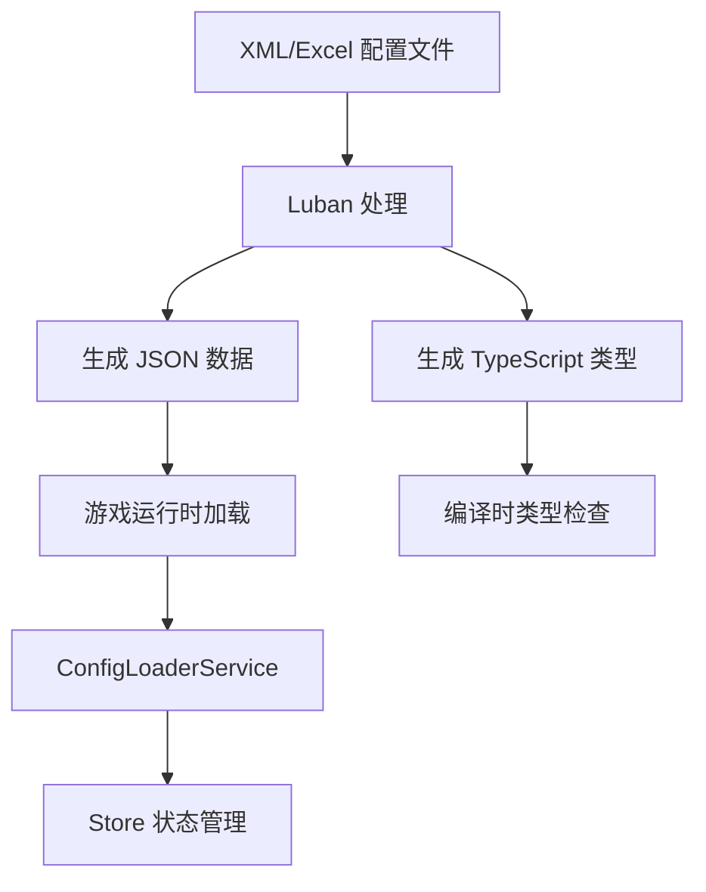

# 配置管理系统

## 概述

配置管理系统是基于 roblox-ts 框架的数据驱动核心，负责管理游戏中的所有静态配置数据，包括武器属性、物品信息、敌人数据、商店配置等。

系统采用 **Luban** 作为配置工具，提供完整的类型安全数据定义、管理和代码生成能力，支持 XML 配置定义、JSON 数据存储，并自动生成 TypeScript 类型文件。

## 架构设计

### 配置数据流



### 目录结构

```markdown
configs/                 # 配置根目录
├── datas/               # 具体数据文件（JSON/Excel）
│   ├── achievement/     # 成就数据
│   ├── enemy/          # 敌人数据
│   ├── equipment/      # 装备数据
│   ├── item/           # 物品数据
│   ├── material/       # 材料数据
│   ├── shop/           # 商店数据
│   └── weapon/         # 武器数据
├── defines/            # Bean 类型定义（XML）
├── tables/             # 表格定义（XML）
├── jsonConfigs/        # 生成的 JSON 配置（运行时使用）
├── luban_templates/    # TypeScript 代码生成模板
└── luban.conf          # Luban 配置文件
```

## 核心概念

### Bean（数据结构）
Bean 是 Luban 中的数据结构定义，类似于 TypeScript 的 interface：

```xml
<!-- defines/item.xml -->
<bean name="ItemConfig">
    <var name="id" type="string"/>
    <var name="name" type="string"/>
    <var name="description" type="string"/>
    <var name="type" type="string"/>
    <var name="rarity" type="string"/>
    <var name="value" type="int"/>
</bean>
```

### Table（数据表）
Table 定义了数据的存储结构和加载方式：

```xml
<!-- tables/item.xml -->
<table name="ItemConfigTable" value="ItemConfig" mode="map" index="id">
    <var name="id" type="string"/>
</table>
```

### 数据文件
实际的配置数据存储在 `datas/` 目录下：

```json
// datas/item/weapon_assault_rifle.json
{
    "id": "weapon_assault_rifle",
    "name": "突击步枪",
    "description": "标准军用突击步枪",
    "type": "ranged",
    "rarity": "uncommon",
    "value": 1500
}
```

## 核心服务

### ConfigLoaderService

`ConfigLoaderService` 是配置管理的核心服务，基于 **Flamework** 依赖注入框架，实现了 `OnInit` 接口：

**主要职责**：
1. **配置数据加载**: 从 JSON 文件加载 Luban 生成的配置数据
2. **数据类型转换**: 将原始数据转换为类型安全的游戏对象
3. **状态管理集成**: 将配置数据注入到 Reflex Store 中
4. **类型映射**: 提供字符串到枚举的映射功能

```typescript
@Service()
export class ConfigLoaderService implements OnInit {
    constructor(private readonly logger: Logger) {}

    public onInit(): void {
        this.logger.Info("[ConfigLoaderService] 开始加载配置数据");
        
        // 加载各类配置
        this.loadItemConfigs();
        this.loadMaterialConfigs();
        
        this.logger.Info("[ConfigLoaderService] 配置数据加载完成");
    }
    
    private loadItemConfigs(): void {
        // 加载物品配置并转换为 ItemDefinition
        const items = this.processItemConfigs(configData);
        store.loadItemDefinitions(items);
    }
    
    // 类型映射方法
    public mapItemType(itemType: string | undefined): ItemType { /* ... */ }
    public mapRarity(rarity: string | undefined): ItemRarity { /* ... */ }
}
```

## 使用方式

### 1. 配置开发流程

完整的配置开发流程包括数据定义、表格配置、数据填充和代码生成：

1. **定义数据结构**: 在 `configs/defines/` 中创建 Bean XML 文件
2. **定义数据表**: 在 `configs/tables/` 中创建 Table XML 文件  
3. **添加数据**: 在 `configs/datas/` 中添加 JSON 数据文件
4. **生成 TypeScript 类型**: 运行 `pnpm run config:codebuild`
5. **生成运行时数据**: 运行 `pnpm run config:build`
6. **开发时监听变化**: 运行 `pnpm run config:watch`

### 2. 客户端访问

配置数据通过 **Reflex Store** 和 **React Hooks** 访问：

```typescript
// 在 React 组件中使用配置数据
function WeaponCard({ weaponId }: { weaponId: string }) {
    const weapon = useSelector(selectItemById(weaponId));
    
    if (!weapon) return null;
    
    return (
        <Frame>
            <TextLabel Text={weapon.name} />
            <TextLabel Text={weapon.description} />
            <TextLabel Text={`价值: ${weapon.baseValue}`} />
        </Frame>
    );
}

// 在控制器中访问配置
@Controller()
export class UIController {
    public getItemData(itemId: string): ItemDefinition | undefined {
        return store.getState().item.definitions.get(itemId);
    }
}
```

### 3. 服务端使用

在服务端通过 **Flamework 依赖注入** 和 **Store** 访问配置：

```typescript
@Service()
export class BattleService {
    constructor(
        private readonly configLoader: ConfigLoaderService,
        private readonly logger: Logger
    ) {}
    
    public getWeaponStats(weaponId: string): EquipmentDefinition | undefined {
        const weapon = store.getState().item.definitions.get(weaponId);
        if (weapon?.type === ItemType.Equipment) {
            return weapon as EquipmentDefinition;
        }
        return undefined;
    }
    
    public validateItemConfig(itemId: string): boolean {
        const item = store.getState().item.definitions.get(itemId);
        return item !== undefined;
    }
}
```

## 最佳实践

### 配置组织
- 按功能模块组织配置文件
- 使用清晰的命名约定
- 保持数据结构的一致性

### 类型安全
- 充分利用 TypeScript 类型检查
- 使用枚举定义固定值选项
- 避免使用 `any` 类型

### 性能优化
- 合理使用数据索引
- 避免过度嵌套的数据结构
- 考虑数据加载时机

### 版本管理
- 配置文件纳入版本控制
- 谨慎处理配置数据的向后兼容性
- 建立配置变更审查流程

## 相关命令

```bash
# 生成 TypeScript 类型定义到 src/types/luban
pnpm run config:codebuild

# 生成运行时 JSON 数据到 configs/jsonConfigs
pnpm run config:build

# 监听配置变化并自动重新生成数据
pnpm run config:watch

# 监听配置变化并自动重新生成代码（开发时使用）
pnpm run config:codewatch

# 完整的开发构建流程（生成类型并编译）
pnpm run dev:compile
```

### 命令详解

| 命令 | 功能 | 输出目录 | 使用场景 |
|------|------|----------|----------|
| `config:codebuild` | 生成 TypeScript 类型文件 | `src/types/luban/` | 修改 Bean/Table 定义后 |
| `config:build` | 生成运行时 JSON 数据 | `configs/jsonConfigs/` | 修改数据文件后 |
| `config:watch` | 监听并自动生成数据 | `configs/jsonConfigs/` | 数据编辑时 |
| `config:codewatch` | 监听并自动生成类型 | `src/types/luban/` | 结构定义编辑时 |
| `dev:compile` | 完整构建（类型+编译） | 多个目录 | 开发启动时 |

## 注意事项

1. **数据一致性**: 确保所有引用的 ID 在对应的配置中存在
2. **类型安全**: 利用生成的 TypeScript 类型进行编译时检查
3. **性能考虑**: 大量配置数据可能影响加载性能
4. **热更新**: 配置变更需要重新构建才能生效

## 相关文档

- [常量定义](061_const.md) - 项目中的常量管理
- [Luban Bean](062_luban_bean.md) - Bean 数据结构定义
- [Luban Table](063_luban-table.md) - 数据表定义
- [Luban 类型](064_luban-type.md) - 类型系统说明
- [Luban 数据](065_luban-data.md) - 数据文件管理