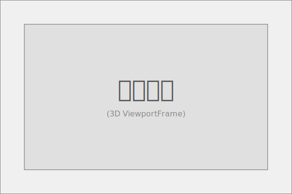

# Playing Screen UI 分解


## 概述

Playing Screen 是游戏战斗过程中的主界面，包含玩家状态信息、波次信息、升级提示和宝箱提示等关键元素。

## 界面布局分析

### 主要区域划分


## 组件层级结构

### 页面组件 (Page Component)

**PlayingScreen** - 战斗进行中的主界面


PlayingScreen 作为页面级组件，负责整个战斗界面的布局和数据管理。它直接与 Store 关联，获取所有必要的游戏状态数据，并分发给各个子组件。

### 组织组件 (Organism Components)

#### 1. PlayerStatusPanel (玩家状态面板)
- **位置**：左上角
- **功能**：集中显示玩家的核心状态信息
- **包含内容**：生命值、等级经验、资源数量


#### 2. WaveInfoPanel (波次信息面板)
- **位置**：顶部中央
- **功能**：显示当前波次进度和时间信息
- **包含内容**：波次计数、倒计时


#### 3. NotificationPanel (通知面板)
- **位置**：右上角
- **功能**：提示玩家重要事件
- **包含内容**：升级提示、宝箱提示


#### 4. BattleScene (战斗场景)
- **位置**：中央主体区域
- **功能**：显示实际的 3D 战斗场景
- **特点**：3D 场景容器，不包含 UI 子组件



### 分子组件 (Molecular Components)

1. **HealthBar** - 生命值条（显示当前/最大生命值）
2. **LevelBar** - 等级经验条（显示等级和经验进度）
3. **ResourceDisplay** - 资源显示容器（包含多个资源项）
4. **ResourceItem** - 单个资源项（图标+数量）
5. **WaveCounter** - 波次计数器（显示当前波次）
6. **WaveTimer** - 波次倒计时（显示剩余时间）
7. **UpgradeIndicator** - 升级指示器（显示可升级数量）
8. **ChestIndicator** - 宝箱指示器（显示可领取宝箱数量）

### 原子组件 (Atomic Components)

1. **ProgressBar** - 通用进度条组件
2. **Text** - 文本显示组件
3. **CircleIcon** - 圆形图标容器
4. **ArrowIcon** - 向上箭头图标
5. **ChestIcon** - 宝箱图标

## 组件树结构

```
PlayingScreen (页面组件 - 关联 Store)
├── PlayerStatusPanel (组织组件)
│   ├── HealthBar (分子组件)
│   │   ├── ProgressBar (原子组件)
│   │   └── Text (原子组件)
│   ├── LevelBar (分子组件)
│   │   ├── ProgressBar (原子组件)
│   │   └── Text (原子组件)
│   └── ResourceDisplay (分子组件)
│       ├── ResourceItem (分子组件) - 金币
│       │   ├── CircleIcon (原子组件)
│       │   └── Text (原子组件)
│       └── ResourceItem (分子组件) - 材料包
│           ├── CircleIcon (原子组件)
│           └── Text (原子组件)
├── WaveInfoPanel (组织组件)
│   ├── WaveCounter (分子组件)
│   │   └── Text (原子组件)
│   └── WaveTimer (分子组件)
│       └── Text (原子组件)
├── NotificationPanel (组织组件)
│   ├── UpgradeIndicator (分子组件)
│   │   └── ArrowIcon[] (原子组件)
│   └── ChestIndicator (分子组件)
│       └── ChestIcon[] (原子组件)
└── BattleScene (组织组件)
```
